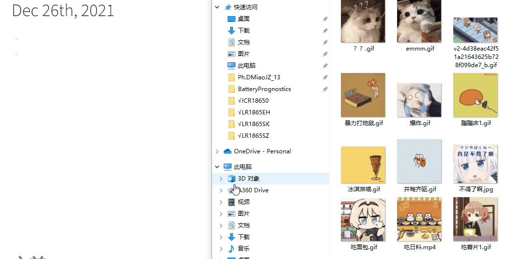

- ### 10.1 插入图片文件
- 一种方式是将文件直接拖入到logseq中，静态图片和动态图片均可~
- （划重点，无论是什么文件，图片，音频，视频等，被拖入到Logseq中的，都会被复制一份，并保存在之前选择好的本地目录下）
- 
- 另外一种方式是【Ctrl+C】复制，然后在logseq中【Ctrl+V】即可
- ### 10.2 插入剪切的图片
  我通常习惯用微信截屏，这样的图片也可以直接【Ctrl+V】粘贴到logseq中~