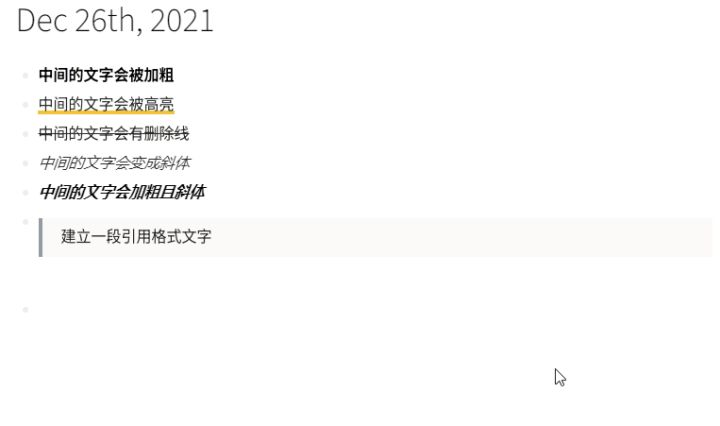

- logseq对markdown语法的支持使得软件的便捷性大大增加！
- ### 14.1 标题
- logseq最多支持6级标题！（注意 # 和文字间有空格！）
- ```
  - # 一级标题
  - ## 二级标题
  - ### 三级标题
  - #### 四级标题
  ```
-
- ### 14.2 加粗 高亮 删除线 斜体 加粗且斜体
- 此处不加空格
- ```
  **中间的文字会被加粗** （快捷键【Ctrl】+【B】）
  ==中间的文字会被高亮== （快捷键【Ctrl】+【Shift】+【H】）
  ~~中间的文字会有删除线~~
  *中间的文字会变成斜体* （快捷键【Ctrl】+【I】）
  ***中间的文字会加粗且斜体***
  ```
- 
- ### 14.3 引用
- （符号和文字间有空格）另外引用也可以嵌套，例如>>> 这是一个二级嵌套引用
- ```
  > 建立一段引用格式文字
  ```
- {:height 434, :width 720}
- ### 14.4 列表
- 注：列表也可以嵌套，利用缩进，即【Tab】增加缩进和【Shift】+【Tab】减少缩进
- ```
  无序列表（注意符号后面有空格）
  * 项目1* 项目2* 项目3
  有序列表（注意 . 后面有空格）
  1. 项目12. 项目23. 项目3
  ```
- ### 14.5 代码
- 此处的符号为【Esc】键下面的【~】，英文输入法下为【`】
- ```
  行内代码 `instanceof()`
  多行代码（即``` ```，注：最后三个【`】一定要换行，否则无法激活代码块）
  ```
- 一个好的建议，因为多行代码要控制缩进，可以先输入两行【```】激活代码块，然后直接在代码块中输入
-