- 
## 1500系统
	- ### PLC系统简介
		- #### PLC的由来
			- 自动化生产线--对生产效率的不断追求的结果
		- #### PLC的发展历史
			- 起源-美国DEC公司20实际70年代初
			- 实用化----20实际70年代~ 20世纪80年代初
			- 快速发展----20世纪80年代~ 20世纪90年代中期  - 西门子S5系列
			- 进步和完善----20世纪末期~至今   - 西门子S7系列
	- ### 常见PLC系统的组成
		- PM/PS, CPU, SM, DI/DO/AI/AO, IM , HMI, 等
		- #### 电源模块 PM / PS
			- ##### PM/电源模块
				- 为CPU、信号模块及其他扩展模块、其他用电设备（例如传感器）提供工作供电。
			- ##### PS/电源模块(system power supply)
				- 为CPU、信号模块及其他扩展模块提供工作供电
			- ##### PM/PS区别
				- PM可以给其他用电设备（如传感器）供电
				- PM有DC24V接线端子，可以外接给其他用电设备
				- PS通过背板连接器供电
		- #### 1500 CPU
			- SIMATIC S7-1500具有高速背板总线、PROFINET性能和极短响应时间，CPU命令处理时间可以达到1ns，可在生产过程中实现极高的生产力和产品质量
			- ##### S7-1500 CPU的家族成员
				- |**常规系列**|**紧凑型**|**运动控制（T）**|**冗余（R/H）**|
				  |--|--|--|--|
				  |1511， 1512， [:br]1513， 1515， [:br]1516， 1517， 1518|集成[:br]1511C, 1512C......|1515T, 1517T|1515R, 1517H|
				  |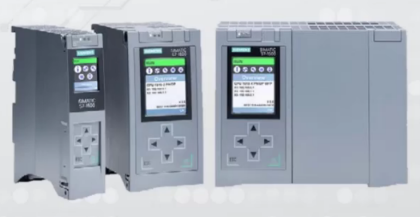| 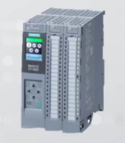 |||
			-
		- ####  1500 信号模块
			- ##### 工业常见信号的分类
				- ###### 电信号
					- 数字信号：分散开的、不存在中间值的量。如开、关， 0， 1。
					- 模拟信号：在一定范围连续变化的量，如0~10V。
			- ##### 数字量模块
				- ###### 数字量输入  DI
					- 信号电压等级： 信号‘0’: -30到+5V
					- 信号电压等级： 信号'1': +11到+30V
					- 数字量输入信号的有效时间（输入延时）： 从‘0’到‘1’的最短时间 3ms，从‘1’到‘0’的最短时间是3ms。
				- ###### 数字量输出  DO
			- ##### 模拟量模块
				- ###### 模拟量输入  AI： 温度、流量
				- ###### 模拟量输出  AO：电机、电磁调节阀等
		- #### 分布式I/O从站 ET200系列
			- ##### ET200 MP系列
				- 高性能，易使用
				- 采用S7-1500的IO模块进行分布式站配置
				- 模块型号少，所有35mm宽的模块均配有统一的前连接器
				- 前连接器的预配合位置可方便的进行预接线
				- 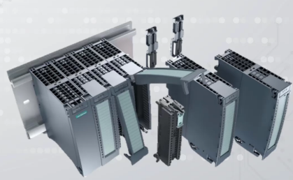
			- ##### ET200 SP系列
				- 体积紧凑、功能强大
				- 无需单独的供电模块形成各个负载组
				- 系统支持永久接线、热插拔、模块空缺运行
				- 更加节省空间的直插式端子，单手接线无需工具
				- 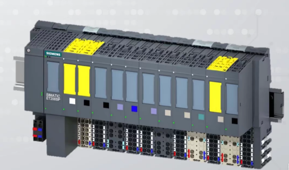
			- ##### ET200 SP HA
				- 与SIMATIC PCS7 结合使用
				- 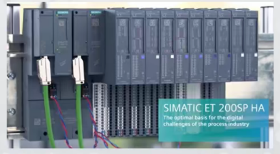
			- ##### ET200 M
				- 采用通用的S7-300 I/O模块
				- 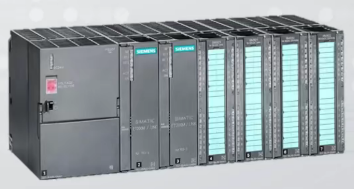
			- ##### ET200 S
				- 结构紧凑，大量信号点数支持，可扩展模块长度最高可至2米。
				- 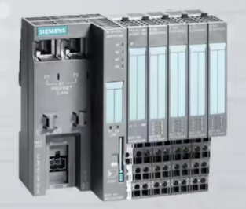
			- ##### ET200 iSP
				- 用于危险区域的久经验证的本质安全型IO系统
				- 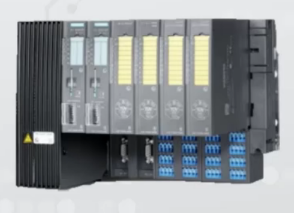
			- ##### ET200 AL
				- 坚固耐用的IO，高防护等级，轻松安装于各种位置
				- 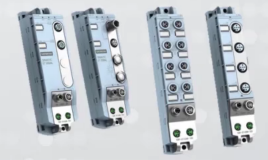
			- ##### ET200 pro
				- 坚固耐用的模块化多功能I/O系统，防护等级为IP65/66/67
				- 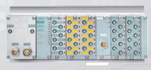
			- ##### ET200 eco PN0
				- 坚固的块型IO，高防护等级
				- 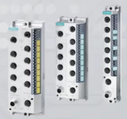
		- #### ET200SP 系统构成及使用
			- 高度灵活的可扩展分布式I/O系统，用于通过现场总线将过程信号连接到上一级控制器
			- ##### 特点
				- 紧凑型设计
				- 易于使用
				- 高性能
				- 安全集成
				- 多种通信协议
				- ...
			- ##### 接口模块IM
				- 用于将ET200 SP连接到网络，实现主/从站之间的数据交换
				- PROFIBUS
				- PROFINET
				- 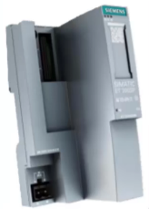
			- ##### 带CPU功能的ET200 SP分布式I/O接口模块
				- 集成了一个类似于1511/1512 性能的CPU。
				- 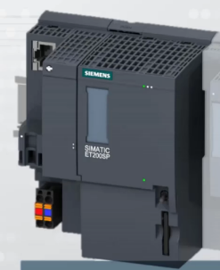
			- ##### ET200 SP 基座单元（BaseUnit）
				- 用于ET200 SP电子模块的机械连接
				- 用于ET200 SP电子模块的电气连接
				- 可以预接线（不带I/O模块）
				- 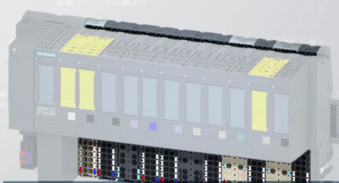
			- ##### 信号模块
				- DI/DO/AI/AO...
				- ST:标准型
				- BA:基本型：简化类型，比标准型简单
				- HF:高性能型： 比标准型多了一些功能，如诊断
				- HS:高速型： 信号处理速度更快
				- 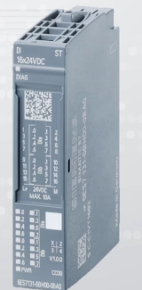
			- ##### 工艺模块
			- ##### 通信模块
			- ##### ET200 SP 服务器模块
				- 服务器模块用于完善ET200 SP的组态
				- 服务器模块包含在接口模块的供货中
				- 有了它背板总线回路才完整
				- 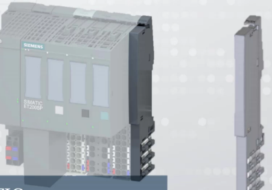
		-
-
-
-
-
-
-
-
-
-
-
-