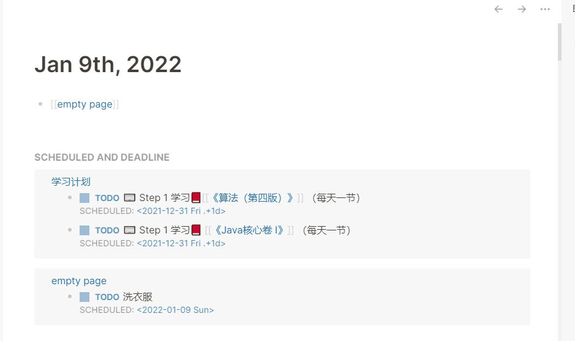
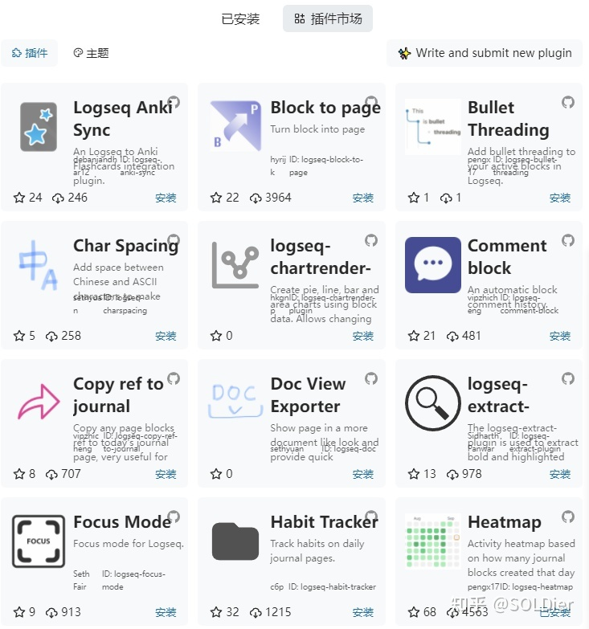
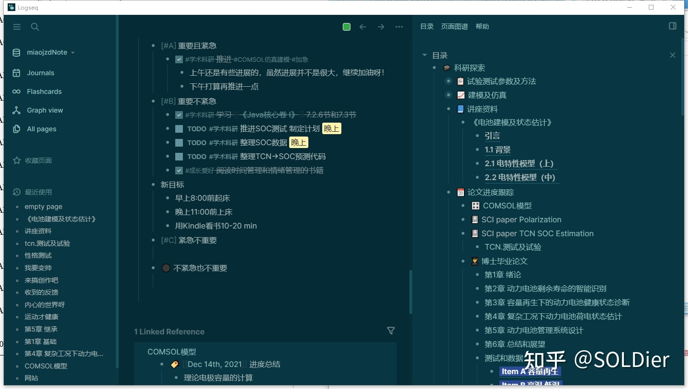

- （此部分可能需要_翻_墙_，因为资源在github上，有时候网速非常慢），其他安装方法还在摸索，后续可能会更新。
- ### 16.1 步骤一：打开开发者模式
- 选中右上方【...】，单击【设置】->【高级设置】，打开【开发者模式】，并【确定】重启。
- 
- ### 16.2 步骤二：安装插件
- 选中右上方【...】，单击【插件】，选择需要的插件，单击【安装】即可。具体的好用的插件会在后续章节介绍。
- 
- ### 16.3 步骤三：安装主题
- 选中右上方【...】，单击【主题】，目前Logseq的主题还算很多，估计后期还会增加，在这里提供一些主题的示例：
- 