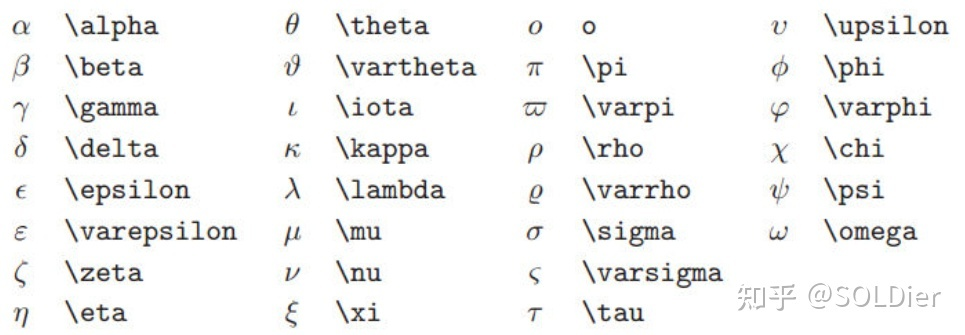

- logseq支持数学公式的显示。注，多个语法组合时，建议用 {} 区分不同部分，避免混淆。
- 汇总表如下，详细效果和内容见表格后：
-
- ### 19.1 基础公式语法
	- 行内公式语法： `$公式内容$` （ps: 可以和文字在同一行）
	- 非行内公式语法：`$$公式内容$$ `（ps: 公式要单独放在一行）
	- 个别公式在行内和单行状态下显示差异较大。
- ### 19.2 下标上标
	- 上标用 ^ 符号，例如 a^2 ，但上标内容大于一个字符时（包括20这种），用 {} 括起来，例如`$a^{2x+y}$ ` : $a^{2x+y}$；
	- 下标用 _ 符号，例如 a_1，但下标内容大于一个字符时，用 {} 括起来，例如 `$a_{2x+y}$` : $a_{2x+y}$
- ### 19.3 根号和n次方根
	- 根号 语法 \sqrt{}，n次方根 语法 `$\sqrt[n]{x}$`: $\sqrt[3]{x}$
- ### 19.4 分数
	- 语法 \frac{分子}{分母} `$\frac{x+1}{x-1}$` : $\frac{x+1}{x-1}$
- ### 19.5 向量
	- 单字符向量 语法 `$\vec{}$` : $\vec{a}$
	- 多字符向右向量 语法 `$\overrightarrow{a}$` : $\overrightarrow{a}$
	- 多字符向左向量 语法 `$\overleftarrow{a}$ : $\overleftarrow{a}$
- ### 19.6 重音符号
	- 三种
	- `$\hat{x}$` : $\hat{x}$
	- `$\bar{} $` : $\bar{x}$
	- `$\tilde{x}$` : $\tilde{x}$
- ### 19.7 积分 极限 求和 乘积
	- 积分语法 `$\int$` $\int$ （例如 `$$\int_{0}^{5}x\mathrm{d}x$$` : $$\int_{0}^{5}x\mathrm{d}x$$，0和5代表积分上下限）；
	- 极限语法 `$\lim$` $\lim$ （例如`$$\lim_{x \to \infty}x$$` : $$\lim_{x \to \infty}x$$）；
	- 求和语法`$ \sum$` \sum （例如`$$\sum_{n=1}^{20} n^{2}$$` : $$\sum_{n=1}^{20} n^{2}$$）；
	- 乘积语法`$\prod$`\prod （例如`$$\prod_{j=1}^{3} y_{j}$$` : $$\prod_{j=1}^{3} y_{j}$$）
- ### 19.8 希腊字母表
- 例如 `$\alpha$`  将会显示α
- 
-