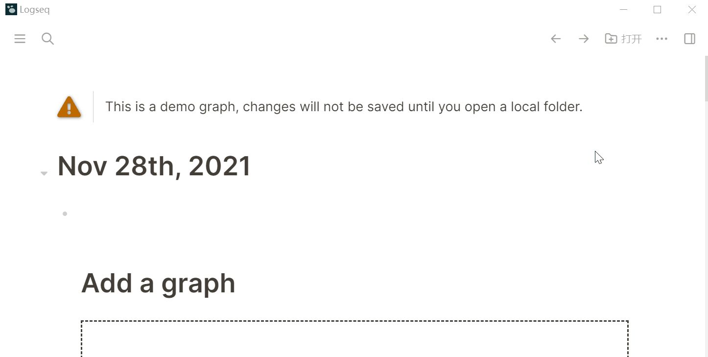
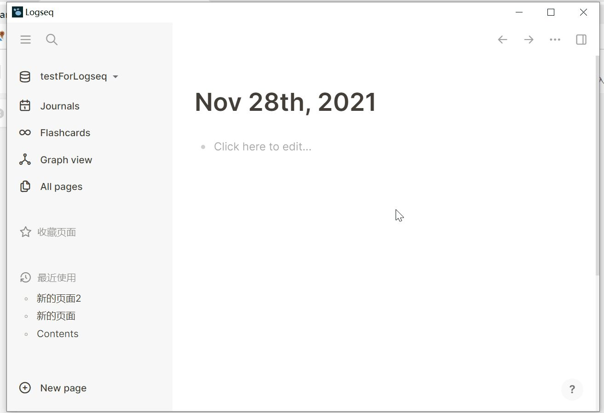

- ### 2.1 选择一个空文件夹
- 未来你的【笔记文件】将全部存在这个文件夹中~
- （PS 在编辑过程中，文件会【自动保存】，不需要手动保存）
- 
-
- ### 初始界面
- 初始界面非常简洁，如图所示，左右【侧边栏】。
- 左【侧边栏】第一项显示的是当前数据库名，第二项【Journals】为日记功能，第三项【Flashcards】为闪卡，第四项【Graph view】是整个笔记的脉络图，第五项【All pages】可以查看所有页面。
- 右【侧边栏】包括【目录】 【页面图谱】和【帮助】
- 