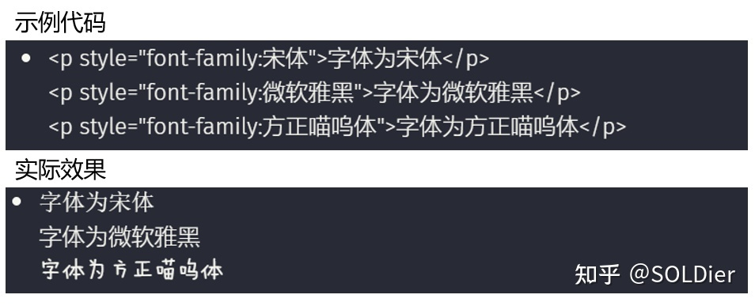
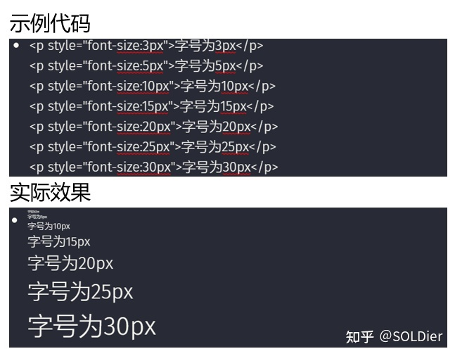
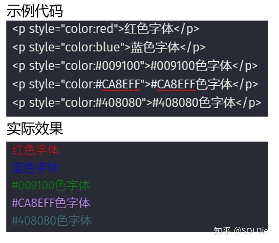
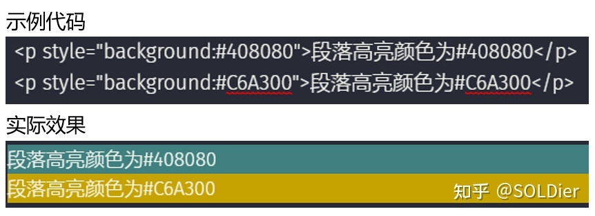
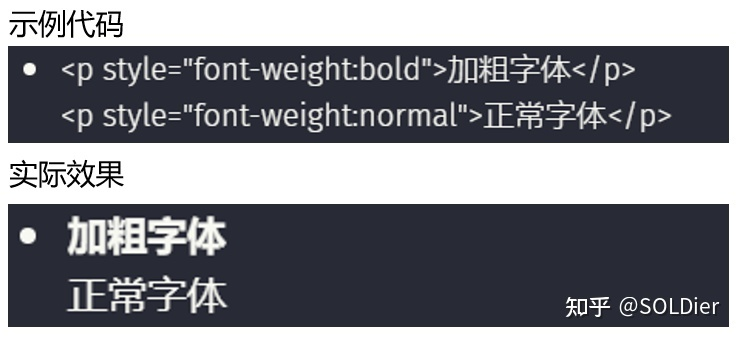
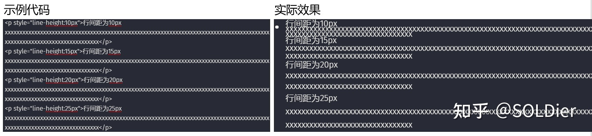
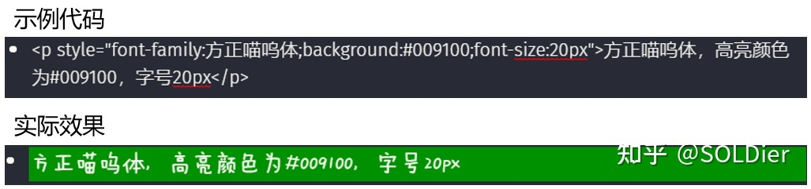

title:: 20 段落|字体|格式

- 采用CSS语法；
- 不需要修改主题文件；
- CSS代码不能和markdown语法同时使用；
- 语法当中的符号都是英文格式的，比如引号和冒号
- 统一语法：
- <p style="font-family:黑体">字体为微软雅黑</p>
-
- ```
  <p style="关键词:值">输入任意文字</p>
  ```
- ### 20.1 字体
	- 关键词：font-family，值：任意字体名称，例如：宋体；
	- 注：任意安装在C:/Windows/fonts文件夹内的字体都可以使用，可以打开word文档查看已安装的字体。
	- 代码示例：
	- ```
	  <p style="font-family:宋体">字体为宋体</p>
	  <p style="font-family:微软雅黑">字体为微软雅黑</p>
	  <p style="font-family:方正喵呜体">字体为方正喵呜体</p>
	  ```
	- 
- ### 20.2 字号
	- 关键词：font-size，值：正整数px，例如：20px；
	- 代码示例：
	- ```.
	  <p style="font-size:3px">字号为3px</p>
	  <p style="font-size:5px">字号为5px</p>
	  <p style="font-size:10px">字号为10px</p>
	  <p style="font-size:15px">字号为15px</p>
	  <p style="font-size:20px">字号为20px</p>
	  <p style="font-size:25px">字号为25px</p>
	  <p style="font-size:30px">字号为30px</p>
	  ```
	- {:height 470, :width 591}
- ### 20.3 颜色
	- #### 20.3.1 字体颜色
		- 关键词：color，值：颜色英文 或 颜色代码，例如：red 或 \#009100；
		- 注：颜色代码可以在百度搜索 颜色代码表 找到
		- 代码示例：
		- ```
		  <p style="color:red">红色字体</p>
		  <p style="color:blue">蓝色字体</p>
		  <p style="color:#009100">#009100色字体</p>
		  <p style="color:#CA8EFF">#CA8EFF色字体</p>
		  <p style="color:#408080">#408080色字体</p>
		  ```
		- 
	- #### 20.3.2 高亮颜色
		- 关键词：background，值：颜色英文 或 颜色代码，例如：red 或 \#009100；
		- 注：颜色代码可以在百度搜索 颜色代码表 找到
		- 代码示例：
		- ```
		  <p style="background:#408080">段落高亮颜色为#408080</p>
		  <p style="background:#C6A300">段落高亮颜色为#C6A300</p>
		  ```
		- 
- #### 20.4 粗细
	- 关键词：font-weight，值：bold（加粗）或 normal（正常）；
	- 代码示例：
	- ```
	  <p style="font-weight:bold">加粗字体</p>
	  <p style="font-weight:normal">正常字体</p>
	  ```
	- 
- ### 20.5 行间距
	- 关键词：line-height，值：正整数px 或 数值；
	- 代码示例：
	- ```
	  <p style="line-height:10px">行间距为10px 输入任意文字</p>
	  <p style="line-height:15px">行间距为15px 输入任意文字</p>
	  <p style="line-height:20px">行间距为20px 输入任意文字</p>
	  ```
	- 
- ### 20.6 多种格式设置
	- 用分号 ; 分割不同的属性（英文输入法下），所有属性都要写入双引号内；
	- 代码示例：
	- ```
	  <p style="font-family:方正喵呜体;background:#009100;font-size:20px">方正喵呜体，高亮颜色为#009100，字号20px</p>
	  ```
	- 上述代码包含三个属性：字体 font-family:方正喵呜体；高亮颜色 background:\#009100；字号 font-size:20px
	- 