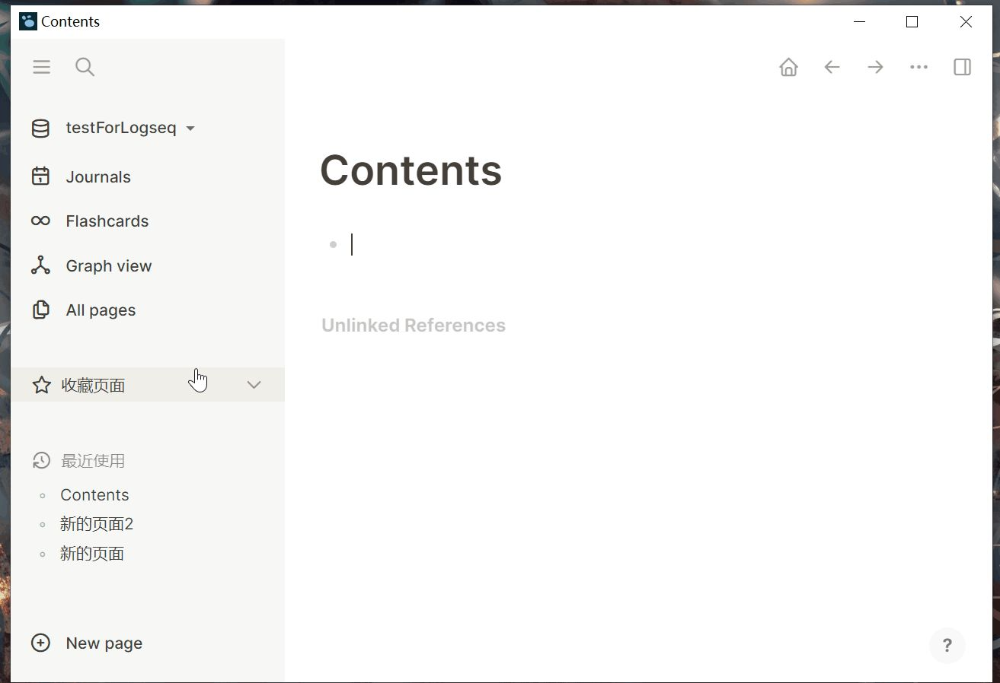
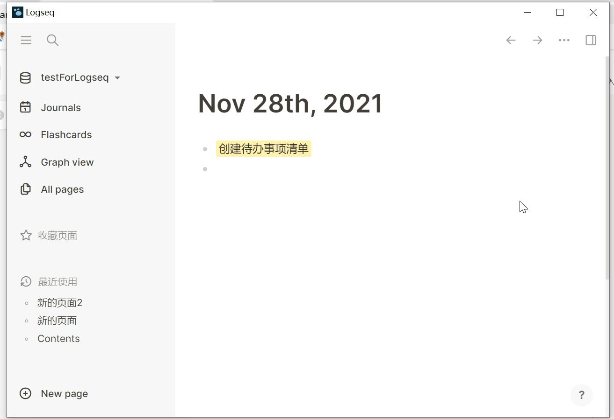

- ### 3.1 通过【Journals】创建日记
- Logseq具有【日记功能】，在右侧边栏选择【Journals】就会进入日记界面，每天会自动生成新的日期。
- 可以通过【安装插件】浏览某一天的日记（见后续教程）
- {:height 540, :width 778}
- ### 3.2 建立一个TODOList代办事项清单
- 按下【/】键，调出命令清单，找到TODO命令；或直接输入TODO
- （关于待办事项的【子母关系】设置见【4.初识块的概念】）
- 
-