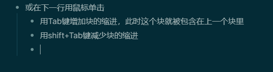
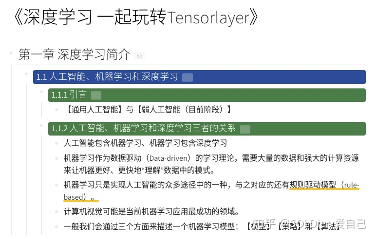

- ### 5.1 块的【展开】和【折叠】
- 一个块就是一个整体，左键单击小圆点前的三角号可以【折叠】或【展开】对应的块
- {:height 155, :width 552}
- ### 5.2 块的【引用】和【超链】
- 我们可以在【任意地方】引用块，像一个网页超链接一样
- 第一步，复制块的地址（类似网址的概念），右键单击小圆点，选择【copy block ref】
- 第二步，ctrl+v 粘贴（可以直接粘贴，程序会自动补全"(())"）
- 在这种情况下，运行【块】之后，会显示第一行的内容，如果想要显示更多的内容，第一步可以选择【copy block embed】
- 我们可以像单击网页链接一样单击，从而跳转过去
- {:height 177, :width 552}
- ### 5.3 颜色定义
- 我们可以给每个【块】定义颜色，只会在第一行显示
- 右键单击小圆点，选择需要的颜色，或者清除颜色（clear）
- 
- 颜色定义也是让笔记结构更加清晰的方法
- 
-