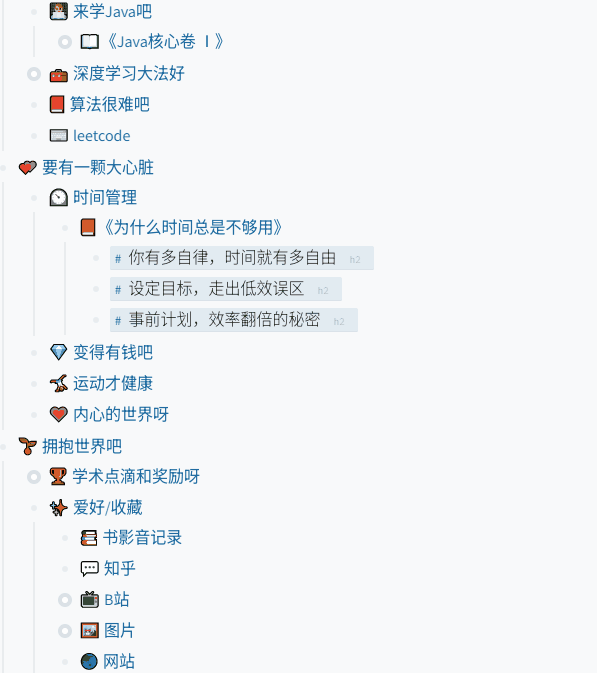
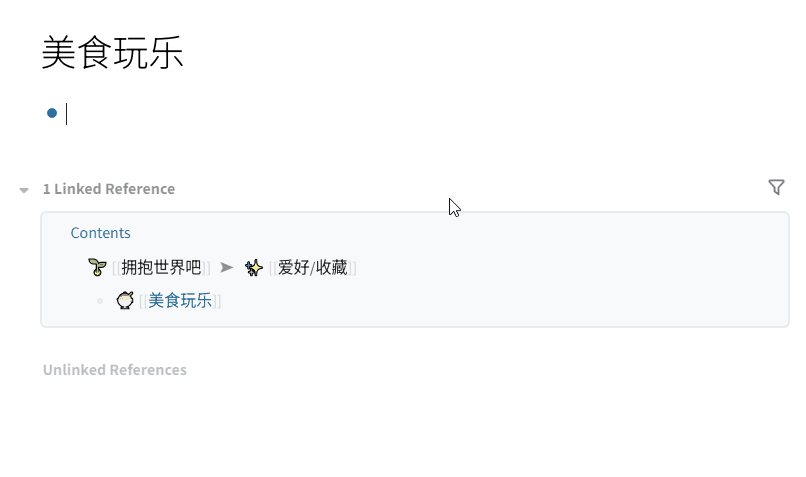

- 【页面】是一个比【块】更大的概念，一个页面是由一个或多个块组成的
- 简单来说，对应到【印象笔记】，【新建页面】就是【新建笔记】
- ### 6.1 新建页面/笔记
- logseq的新建页面非常随意，只需要两个方括号[[]]，在方括号中间输入笔记名字就可以，而没有图形化界面的选项供选择
- {:height 376, :width 622}
- 一个页面下可以有多个页面，当然最小单位还是块
- 我们也可以直接在目录中预先定义好笔记结构（这部分在后面的【目录】教程中会进一步说明），再编辑，主要利用【页面】【块的引用】和【Tab】【Tab+shift】键调整缩进
- 
- ### 6.2 页面的【引用】或【超链】
- 页面（笔记）的引用非常方便，和块的引用类似，但更加方便，仍旧是【两个方括号】，输入已有的页面名字就可以，或者输入一个开头，logseq会列出已有的页面供你选择。
- 
- ### 6.3 其他
- logseq中的笔记/页面的创建非常随意，并且没有删除的概念（新开发的插件有这个功能），如果你建立的某个笔记过了一段时间对你来说不再有什么意义，也无需理会，你可以只是把目录中的引用删掉就可以。