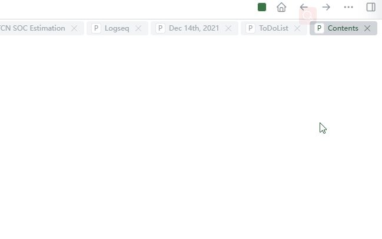
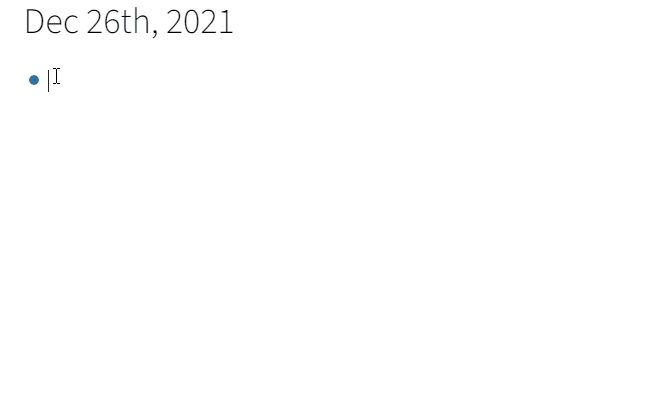
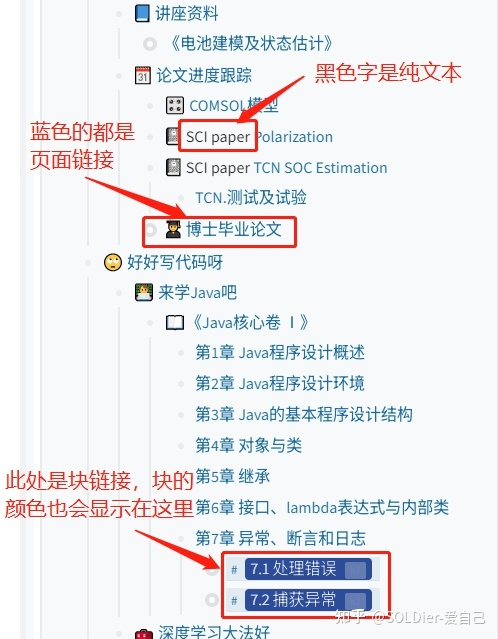

- Logseq有一个默认的页面叫Contents，即目录页面，目录页面和其他页面一样支持各种自由编辑和操作。
- 
- 或者可以在任意地方输入[[Contents]]后，访问该目录页面
- 
- 我们可以直接在侧边栏中编辑目录（这样更方便），或者去目录页面编辑。
- 构建时可以采用三种形式：纯文本，页面链接和块链接。出于构建目录结构的考虑，可以在目录中直接新建页面，例如在侧边栏目录界面中输入[[第1章 xxxxx]]。（PS: 侧边栏目录页面和普通页面没有区别，按【Tab】键降低层级（增加缩进），按【Shift】+【Tab】键升高层级（减少缩进），此处的块也是可以折叠和展开的）
- 
-