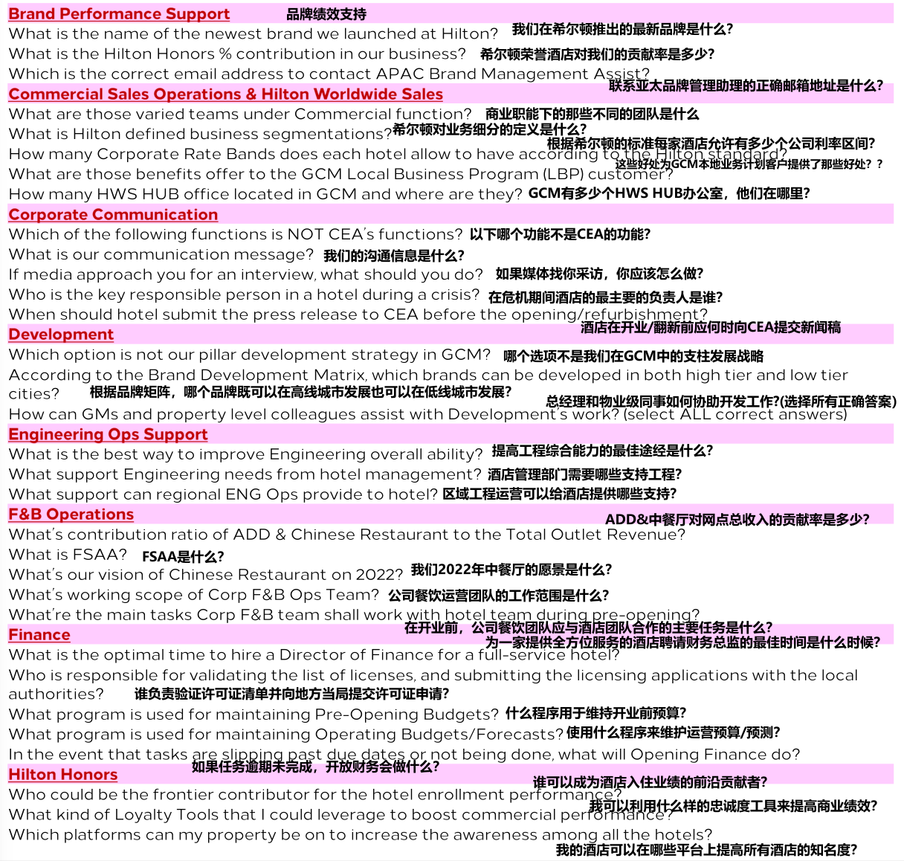
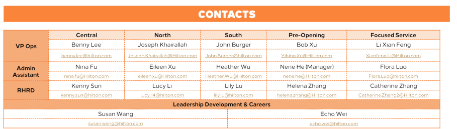

- # 第1页
	- 
	- # 新任总经理手册
	- ## 新总经理入职和熟悉计划
		- 
		- ### 欢迎
		- 首先，欢迎并祝贺您在希尔顿担任总经理一职。本手册可作为指导，帮助您完成 总经理 入职和熟悉计划。您可能会找到所有相关信息、步骤和支持，以确保您有一个美好的学习之旅。
			- 
			- 在这本手册中，您可以在指尖找到以下内容：-
				- 1. 时间线
				  2. 总经理伙伴计划
				  3. 总经理起步套件
				  4. 总经理熟悉计划
				  5. 报到及回顾审查
		- 
			- ### 角色和职责
			- 一个优秀的领导者也是一个优秀的学习者。在接下来的6个月里，您必须靠自己让您的学习之旅保持强劲的步伐。你需要：
				- 致力于本计划
				- 做一个积极和好奇的学习者
				- 建立网络 - 主动联系您的伙伴、同行、区域专家和直接经理
				- 在您的总经理好友酒店组织沉浸式课程
				- 与您的伙伴一起完成沉浸式学习清单
				- 完成所有的学习，即在总经理熟悉计划之前复习总经理起步套件里的所有的记录，PPT和资料。
				- 自我驱动的在线学习并为相关问题做好准备
				- 在参加课程之前，提前安排您的会议或约会，以便参加总经理熟悉计划中的公开课
				- 定期让您的直接经理了解您的进度-每月一次
				- 为您的回顾审查会议做好准备-在入职后的第6个月
- # 第2页
	- 
		- ### 时间线
		- 这是一个6个月的计划（24个星期），这趟旅程从您加入希尔顿的那天开始。在这24星期里，您将获得或提供所有必要的支持和在线自学工具包，以完成您的旅程。因此，请确保您根据全部完成学习活动来安排 和管理时间。在此过程中，如果您有任何问题或需要任何帮助，将会有人能够并且会支持您。
	- {:height 688, :width 746}
		- **第一个月（-周至第4周） - 欢迎和入职**
			- 公告
			- 管理设置
			- 欢迎电话/邮件和礼包
			- 接收总经理起步套件
			- 总经理伙伴指定
			- 沉浸式计划安排
		- **第二个月（第5周至第8周）- 完成沉浸式和自我学习**
			- 完成沉浸式学习检查清单
			- 完成所有的总经理起步套件里的学习，即复习所有的功能PPT， 录音/记录， 网络研讨会， 文档等。
			- 完成准总经理熟悉度调查
			- 参加总经理熟悉计划
		- **第三至五个月（第9周至第24周）- 学习 & 支持 继续**
			- 与直接经理报到
			- 继续总经理伙伴支持
			- 继续区域专家支持或访问
			- 网络研讨会签到
		- **第6个月（第24周）- 审查/回顾 & 关闭**
			- 试用期反馈会议-与直属经理即AGM & VP（副总裁？）
			- 运营副总裁和区域专家的闭幕电话或访问
- # 第3页
	- 
	- ### 总经理伙伴计划指导
		- 
		- #### 介绍
			- 为了营造希尔顿家庭的归属感和接纳感，伙伴（指总经理伙伴）是一位经验丰富的总经理，他会在新加入/晋升的总经理入职前6个月进行指导。
			- 总经理伙伴为新总经理提供了一个可靠、值得信赖的单点联系人，以解决他/她有关希尔顿的角色和经验的问题。
			- 总经理伙伴还提供日常工作方面的建议和指导，并提供有助于将新总经理引入希尔顿文化的知识资源。
		- 
		- #### 职责
			- **计划&日程**
				- 花时间了解更多关于新任总经理的信息
				- 联系和安排新任总经理的电话
				- 对新任总经理可以从你那里得到什么设定期望
				- 决定通话频率
				- 研究位置和财产
				- 为需要后续行动的事项腾出时间
				- 向利益相关者报告疑虑/担忧
			- #### 希尔顿化
				- 希尔顿文化和规范简介
				- 将新任总经理与对他们的角色很重要的其他同事建立关系
				- 熟悉区域/全球报告、截止日期和内部审计
				- 启发/开导各种希尔顿平台和网站
				- 回答问题- 通常不止一次
			- #### 建立关系
				- 分享个人履历和经验
				- 了解新任总经理的风格和个性/性格
				- 建立融洽关系
				- 充当非正式资源人
				- 确保开放的交流/沟通
				- 尊重机密
				- 通过分享必要的文件和最佳实践/例子，使新任总经理能够采取行动。
		- 
		- #### 给总经理伙伴的提示
			- 要有耐性，建立关系需要时间
			- 不要尝试刚开始就能面面俱到
			- 允许总经理成长为他们自己的角色（允许新任总经理按照他们自己的角色成长）
			- 保持良好的教学精神
			- 问问题的方式：“您需要什么？”或“我能怎么帮您”
		- #### 给总经理的提示
			- 与您的好友积极跟进
			- 对新的思维方式和行为方式持开放态度
			- 联系积极倾听
			- 保持谦虚，勇敢提问
			- 准时参加所有会议/电话
		- 
		- #### 额外资源
			- Linkedln - [Learn from your Peers, Developing continuous learning processes](https://www.linkedin.com/learning/developing-a-mentoring-program/developing-continuous-learning-processes?u=2086084), and [Learn to Listen](https://www.linkedin.com/learning/leading-in-government/learn-to-listen?u=2086084)
			- 阅读高效入职流程的好处  - [Article, HBR](https://hbr.org/2017/06/your-new-hires-wont-succeed-unless-you-onboard-them-properly)
			- 必要的反馈 [Hilton University Connect](https://jam4.sapjam.com/wiki/show/YUYbtyeDaHqta5E6bOuXmR)
- # 第4页
	- 
	- **总经理伙伴计划 - 沉浸式和学习清单**
		- 
		- ### 介绍
			- 沉浸式和学习清单有助于确保总经理伙伴与新任总经理一起完成所有必要的学习任务，反之亦然。该清单涵盖了6个职能，包含综合及行政、运营、业务发展、人力资源和财务。根据总经理的个人资料，有6种不同类型的清单。请根据您的个人资料状态选择清单。
		- 
		- ### 总经理沉浸和学习清单-关键配置文件
			- 1. 总经理搬到营业中的酒店 - 同一品牌
			  2. 总经理搬到营业中的酒店 - 不同品牌
			  3. 总经理搬到开业前的酒店 - 同一品牌
			  4. 总经理搬到开业前的酒店 - 不同品牌
			  5. 新晋升的总经理/非希尔顿总经理 - 营业中的酒店
			  6. 新晋升的总经理/非希尔顿总经理 - 开业前的酒店
		- 
- # 第5页
	- 
	- ### **总经理伙伴计划 - 沉浸式和学习清单** - 综合及行政
		- 
		- 
- # 第6页
	- 
	- ### **总经理伙伴计划 - 沉浸式和学习清单** - 操作清单
	- 
	- 
- # 第7页
	- 
	- ### 总经理伙伴计划-沉浸和学习清单 - 业务发展
	- {:height 861, :width 1076}
	- 
- # 第8页
	- 
	- 
- # 第9页
	- 
	- ### 总经理伙伴计划--沉浸式和学习清单- 财务
	- 
	- 
- # 第10页
	- 
	- ## 总经理起步套件-总经理入职&熟悉计划
	- 
	- ## 介绍
		- 作为入职培训进程的一部分，总经理起步套件包括所有新任总经理在总经理熟悉计划之前完成的所有在线预学习任务。所有新任总经理必须自学和回顾所有材料，包括职能部门的记录报告（如果使用）。总学习时间约为12小时。总经理熟悉度调查中包含的每个功能都会有一个测验，以测试您的知识记忆力。
	- {:height 472, :width 1076}
	- 
	- ## 指引
		- 总经理起步套件已被上传到希尔顿OneDrive。为了获取相关权限，请确保您有有效的希尔顿邮箱地址。
			- 1. 点击 [链接](https://hilton-my.sharepoint.com/:f:/p/sam_chen/El8ZokCYgzBNuKqly4dvz70Btj6GgRO8HWxeKPt1prrX9Q?e=X6N3lm) 获取这些材料
			  2. 输入您的希尔顿邮箱和邮箱账号密码（如果需要）并选择文件夹
			  3.获取各个文件夹里的资料并下载（如果愿意）
- # 第11页
	- 
	- ## 总经理起步套件-总经理入职&熟悉计划- 学习菜单
	- 
	- 
- # 第12页
	- 
	- ## 总经理起步套件-总经理入职和熟悉计划-测验
	- 
	- 测验
		- 这是测验中的问题示例，为了帮助您准备在线测试，建议你在每次学习完学习内容或各个功能的资料后都把答案写在这张纸上。测验中大约有100个问题，请注意所有答案必须在线填写， 在总经理熟悉计划开始前两周区域团队会发送一个链
		- 
- # 第13页
	- 
	- 
	-
- # 第14页
	- {:height 538, :width 766}
	- 
- # 第15页
	- 
	- ### 熟悉计划-总经理入职&熟悉计划
	- 
	- #### 介绍
		- 上海地区办事处将组织为期 3 天的总经理熟悉计划，新总经理将在完成总经理启动工具包中的自学任务清单要求后与所有高级领导团队会面并与职能专家联系
	- 
	- 概览信息
		- 领导力发展和职业团队将至少提前一个月确认总经理熟悉计划的日期，并通常会向您发送确认。该计划将于每周二（日期）上午 9 点开始，到每周四（日期）下午 6 点结束。
		- 地点将在我们的上海区域办事处
		- 除了您的旅行和住宿费用外，参加该计划没有额外费用。
		- 我们办公室的着装要求是明智的（对于男人，不需要领带）
		- 请注意，这个总经理熟悉计划是 GCM 的倡议，它与品牌培训不同，即总经理激活计划。因此，您需要按照品牌团队的标准要求参加总经理激活计划。
	- 
	- ### 虚拟的网络研讨会
		- 如果有一些不可避免的情况，例如新冠疫情，该计划将以虚拟的方式进行，需要4个半天的时间。所有新任总经理在参加虚拟网络研讨会时都必须打开摄像头。在虚拟总经理熟悉计划网络研讨会之前，还需要完成总经理启动工具包中的自学任务列表。
- # 第16页
	- 
	- ### 熟悉计划-总经理入职及熟悉计划
	- 
	- ### 日程-样例
		- 一份确认的日程复印件会在总经理熟悉计划日程前一周分享给您。
	- 
	- 
	- ### 公开课
		- 开放的会议时间段可供您与我们的职能专家进行额外的商务会议预约。本次会议将安排在第 3 天下午 1 点到 5 点 30 分。一旦您收到确认的议程（至少在计划前一周），您可能已经开始与我们的同事安排和预约您的会议，以确保您的会议..我们鼓励您在我们上海地区办事处工作时抓住这个机会，闭幕式安排在下午 5:30 与 excom 进行问答。
- # 第17页
	- 
	- ## 入职及回顾-总经理入职及熟悉计划
	- 
	- ### 报到
		- 建议您在入职后的第三个月与您的直接经理（既AGM或VP Ops)进行签到。目的是更新您当前的状态并向您的经理提供反馈以确认您的连续入职体验。为了协助您办理入职手续，这里有三个示例问题供您准备（但不限于您自己的问题）。
			- 1. 您如何适应希尔顿/酒店文化？
			  2. 您与利益相关者（即业主、区域专家和酒店团队）的关系如何？
			  3. 您现在面临的挑战是什么，您需要什么样的即时支持？
	- 
	- ## 回顾
		- 您的直接经理将安排一次正式的审查会议，以通过您的试用审查。将从您的利益相关者那里收集反馈以支持会议，并将与您分享。
		-
	- 
	- ### 跟进
		- 根据审查会议，建议与您的直接经理一起制定您自己的个人行动计划。要继续与希尔顿一起学习和成长，请访问 Lead@hilton 获取更多可用工具和资源。
	- 
	- ### 计划结束和事后调查
		- 项目后调查将发送给您，以收集您对该项目的反馈，以帮助我们改善和提升未来总经理的体验
	- 