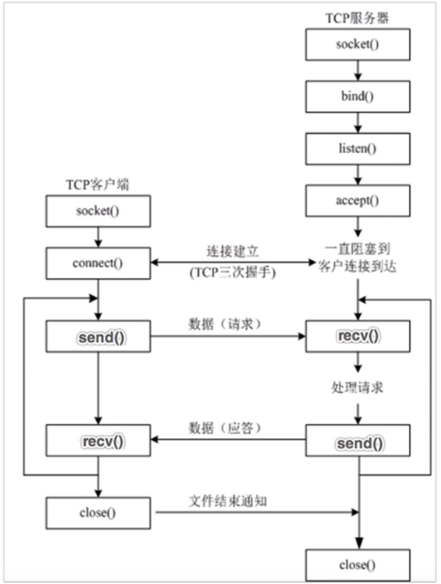
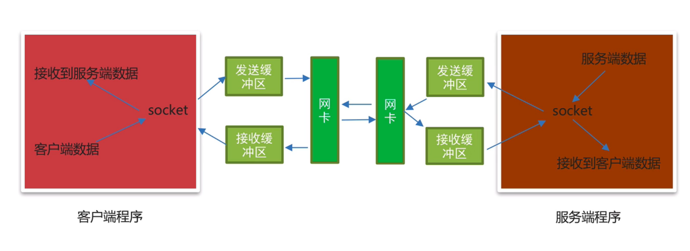

- TCP网络应用程序开发分为：
	- TCP客户端程序开发
		- 客户端程序指运行在用户设备上的程序，主动发起建立连接请求
		- TCP客户端程序开发流程介绍
			- 流程
				- 1 创建客户端套接字对象, AF-INET表示IPv4地址类型，SOCK_STREAM表示TCP传输协议类型
				- 2 和服务端套接字建立连接
				- 3 发送数据
				- 4 接受数据 recv阻塞等待数据的到来
				- 5 关闭客户端套接字
			- 
			- Socket类的介绍
				- 导入模块 `import socket`
			- 创建客户端socket对象使用socket类
				- `socket.socket(AddressFamily, Type)`
			- 客户端socket类的参数和方法说明
				- |参数名|说明|
				  |AddressFamily|IP地址类型，分为IPv4 和IPv6|
				  |Type|传输协议类型|
			- 开发客户端用到的函数
				- |方法名|说明|
				  |connect|和服务端套接字建立连接|
				  |send|发送数据|
				  |recv|接收数据|
				  |close|关闭连接|
				- ```python
				  import socket
				  
				  if __name__ == "__main__":
				      # 1 创建客户端套接字对象, AF-INET表示IPv4地址类型，SOCK_STREAM表示TCP传输协议类型
				      tcp_client_socket = socket.socket(socket.AF_INET, socket.SOCK_STREAM)
				      # 2 和服务端套接字建立连接
				      tcp_client_socket.connect(("192.168.127.1", 8080))
				      # 3 发送数据
				      tcp_client_socket.send('nihaoma'.encode(encoding='utf-8'))
				      # 4 接受数据 recv阻塞等待数据的到来
				      recv_data = tcp_client_socket.recv(1024)
				      print(recv_data.decode())
				      # 5 关闭客户端套接字
				      tcp_client_socket.close()
				  ```
	- TCP服务端程序开发
		- 服务端程序指运行在服务器设备上的程序，专门为客户端提供数据服务。等待接受服务请求。
		- 基本流程
			- 1 创建服务端套接字对象 'socket'
				- 参数1： 'AF_INET'，表示IPv4地址类型
				- 参数2：‘SOCK_STREAM', 表示TCP传输协议类型
			- 2 绑定IP地址和端口号 ’bind'
				- 参数1： 元组，比如：(' ', 端口号), 元组里面的一个元素是ip地址，一般不需要设置，第二个元素是启动程序后使用的端口号。
			- 3 设置监听 ‘linsten'
				- 参数1： 最大等待连接数
			- 4 等待接受客户端的连接请求 ’accept'
			- 5 接收数据 'recv'
				- 参数1： 表示每次接受数据的大小，单位是字节，注意：解码成字符串使用decode()方法
			- 6 发送数据 'send'
				- 参数1：要发送的二进制数据，注意：字符串需要使用encode()方法进行编码
			- 7 关闭套接字 'socket' 表示通信完成
		- 
		- Socket类的介绍
			- 导入模块 `import socket`
		- 创建客户端socket对象使用socket类
			- `socket.socket(AddressFamily, Type)`
		- 服务端socket类的参数和方法说明
			- |参数名|说明|
			  |AddressFamily|IP地址类型，分为IPv4 和IPv6|
			  |Type|传输协议类型|
		- TCP服务端程序开发相关函数
			- |方法名|说明|
			  |bind|绑定IP地址和端口号|
			  |listen|设置监听|
			  |accept|等待接受客户端的连接请求|
			  |send|发送数据|
			  |recv|接受数据|
		- ```python
		  import socket
		  
		  if __name__ == '__main__':
		      # 1 创建服务端套接字对象
		      tcp_server_socket = socket.socket(socket.AF_INET, socket.SOCK_STREAM)
		      # 设置端口复用
		      tcp_server_socket.setsockopt(socket.SOL_SOCKET, socket.SO_REUSEADDR, True)
		      # 2 绑定IP地址和端口号,如果bind中的参数第一个IP地址元素设置为""，默认为本机IP地址
		      tcp_server_socket.bind(("192.168.127.1", 8080))
		      # 3 设置监听 128:代表服务端等待排队连接的最大数量
		      tcp_server_socket.listen(128)
		      # 4 等待接受客户端的连接请求   accept阻塞等待  返回一个用以和客户端通讯的socket，客户端的地址
		      conn_socket, ip_port = tcp_server_socket.accept()
		      print("客户端地址：", ip_port)
		      # 5 接收数据
		      recv_data = conn_socket.recv(1024)
		      print("接收到的数据：", recv_data.decode('utf-8'))
		      # 6 发送数据
		      conn_socket.send("客户端你的数据我收到了".encode())
		      # 7 关闭套接字
		      conn_socket.close()
		      tcp_server_socket.close()
		  ```
	- #+BEGIN_QUOTE
	  TCP网络应用程序注意点的介绍
	  #+END_QUOTE
		- 1. 当TCP客户端程序想要和TCP服务端程序进行通信的时候必须要先建立连接
		  2. TCP客户端程序一般不需要绑定端口号，因为客户端是主动发起建立连接的
		  3. TCP服务端程序必须绑定端口号，否则客户端找不到这个TCP服务都程序。
		  4. listen后的套接字是被动套接字，只负责接受新的客户端的连接请求，不能收发消息。
		  5. 当TCP客户端程序和TCP服务器程序连接成功后，TCP服务器端程序会产生一个新的套接字，收发客户端消息使用该套接字。
		  6. 关闭accept返回的套接字意味着和这个客户端已经通信完毕。
		  7. 当客户端的套接字调用close后，服务器端的recv也会解阻塞，返回的数据长度为0，服务端可以通过返回数据的长度来判断客户端是否已经下线，反之服务端关闭套接字，客户端的recv也会解阻塞，返回的数据长度为0.
	- socket之send和recv原理剖析
		- TCP socket的发送和接受缓冲区
			- 当创建一个TCP socket对象的时候会有一个发送缓冲区和一个接收缓冲区，这个发送和接收缓冲区指的就是内存中的一片空间。
		- send原理剖析
			- 要想发送数据，必须通过网卡发送数据，应用程序是无法直接通过网卡发送数据的，它需要调用操作系统接口，也就是说，应用程序把发送的数据先写入到发送缓冲区（内存中的一片空间），再由操作系统控制网卡把发送缓冲区的数据发送给服务端网卡。
		- recv原理剖析
			- 应用软件是无法直接通过网卡接受数据的，它需要调用操作系统接口，由操作系统通过网卡接收数据，把接收的数据写入到接收缓冲区（内存中的一片空间），应用程序再从接收缓冲区获取客户端发送的数据。
		- 
	- 多任务TCP服务端程序开发
		- ```python
		  import socket
		  import threading
		  
		  # 处理客户端函数
		  def handle_client(conn_socket):
		      # 5 接收数据
		      recv_data = conn_socket.recv(1024)
		      print("接收到的数据：", recv_data.decode('utf-8'))
		      # 6 发送数据
		      conn_socket.send("客户端你的数据我收到了".encode())
		      # 7 关闭套接字
		      conn_socket.close()
		    
		  if __name__ == '__main__':
		      # 1 创建服务端套接字对象
		      tcp_server_socket = socket.socket(socket.AF_INET, socket.SOCK_STREAM)
		      # 设置端口复用
		      tcp_server_socket.setsockopt(socket.SOL_SOCKET, socket.SO_REUSEADDR, True)
		      # 2 绑定IP地址和端口号,如果bind中的参数第一个IP地址元素设置为""，默认为本机IP地址
		      tcp_server_socket.bind(("192.168.127.1", 8080))
		      # 3 设置监听 128:代表服务端等待排队连接的最大数量
		      tcp_server_socket.listen(128)
		  
		      while True:
		          # 4 等待接受客户端的连接请求   accept阻塞等待  返回一个用以和客户端通讯的socket，客户端的地址
		          conn_socket, ip_port = tcp_server_socket.accept()
		          print("客户端地址：", ip_port) 
		          # 使用多线程去接收多个客户端的请求
		          sub_thread = threading.Thread(target=handle_client, args=(conn_socket, ))
		          sub_thread.start()
		          
		      tcp_server_socket.close()
		  ```