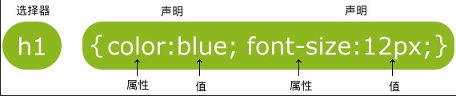

## CSS [CSS3](http://c.biancheng.net/css3/)
background-color:: blue
	- ### 什么是 CSS?
	  background-color:: green
		- CSS 指层叠样式表 (Cascading Style Sheets)
		- 样式定义如何显示 HTML 元素
		- 样式通常存储在样式表中
		- 把样式添加到 HTML 4.0 中，是为了解决内容与表现分离的问题
		- 外部样式表可以极大提高工作效率
		- 外部样式表通常存储在 CSS 文件中
		- 多个样式定义可层叠为一个
		- ##### 样式解决了一个很大的问题
			- HTML 标签原本被设计为用于定义文档内容，如下实例：
			- ``` html
			  			  <h1>这是一个标题</h1>
			  			  <p>这是一个段落。</p>
			  ```
			- 样式表定义如何显示 HTML 元素，就像 HTML 中的字体标签和颜色属性所起的作用那样。样式通常保存在外部的 .css 文件中。我们只需要编辑一个简单的 CSS 文档就可以改变所有页面的布局和外观。
		- CSS： Cascading Style Sheet(层叠样式表语言)。是一种样式表语言，专门用来修饰HTML页面的。通过CSS可以将页面子元素与显示效果分离，提高页面的复用性和可维护性。样式使用属性键/值对的方式工作。CSS预定义了一系列的属性键，开发者可以设置这些属性的值以实现对页面显示的控制。让HTML页面更好看。CSS是离不开HTML的。
	- ### CSS语法
	  background-color:: green
		- CSS的语法非常简单，CSS语法规则由两个主要的部分构成，分别是**选择器**，以及**一条或多条声明**，具体语法结构如图所示。
		- CSS声明总是以分号 **;** 结束，声明总以大括号 **{}** 括起来:
		- 每条声明由一个属性和一个值组成。**属性（property）**是您希望设置的样式属性（style attribute）。每个属性有一个值。属性和值被冒号分开
		- 
		- CSS 实例
			- `p {color:red;text-align:center;}`
			- 为了让CSS可读性更强，你可以每行只描述一个属性:
			- ``` css
			  			  p
			  			  {
			  			      color:red;
			  			      text-align:center;
			  			  }
			  ```
	- ### CSS选择器
	  background-color:: green
		- 选择器由 HTML 元素的 id、class 属性或元素名本身以及一些特殊符号构成，用来指定要为哪个 HTML 元素定义样式。选择器是 CSS 样式规则中重要的组成部分，我们可以将选择器看作是 CSS 样式与 HTML 元素之间的匹配模式，与选择器关联的样式规则会应用于选择器所指定的 HTML 元素上。CSS 中提供了多种不同类型的选择器，您可以根据自己的喜好来选择使用。
		- #### 1. 通用选择器
		  background-color:: #978626
			- 通用选择器用星号*表示，它不匹配某个特定的 HTML 元素，而是匹配 HTML 文档中的每个元素。在开发中，我们通常使用通用选择器来清除 HTML 元素中默认的内外边距，如下所示：
			- ``` css
			  			  * {
			  			      margin: 0 auto;
			  			      padding: 0;
			  			  }
			  ```
			- > 注意：虽然通用选择器内的样式规则能够应用于 HTML 文档中的每个元素，但并不建议在生产环境中过于频繁地使用通用选择器。正是因为通用选择器会匹配网页上每个元素的特点，频繁的使用会给浏览器带来太多不必要的压力。
		- #### 2. 标签选择器
		  background-color:: #978626
			- 一个完整的 HTML 文档由各式各样的标签组成，而标签选择器可以通过具体的标签名称来匹配文档内所有同名的标签，如下所示：
			- ``` css
			  			  p {
			  			  	color:blue;
			  			  }
			  ```
			- `p`选择器能够匹配文档中所有的`<p>`标签
		- #### 3. ID选择器
		  background-color:: #978626
			- ID 选择器用来匹配 HTML 文档中具有指定 ID 属性的标签，ID 选择器的定义需要用到井号# ，后面紧跟 ID 属性的值，如下所示：
			- ID 选择器用来匹配 HTML 文档中具有指定 ID 属性的标签，ID 选择器的定义需要用到井号# ，后面紧跟 ID 属性的值，如下所示：
			- `#nav`选择器能够匹配文档中具有`id="nav"`属性的标签。
			- ``` css
			  			  #nav {
			  			      color: red;
			  			  }
			  ```
		- #### 4. 类选择器
		  background-color:: #978626
			- 类选择器可以根据标签的 class 属性匹配具体的 HTML 标签，所有符合条件的标签都会根据选择器内的样式进行格式化。类选择器的定义需要用到一个英文的句号.，后面紧跟 class 属性的值，如下所示：
			- ``` css
			  			  .black {
			  			    color: black;
			  			  }
			  ```
			- `.black`选择器能够匹配文档中所有具有`class="black"`属性的标签。
			- 由于 class 属性不是唯一的，可以应用于不同的标签，因此您还可以在定义类选择器时指定具体的标签，如下所示：
			- ``` css
			  			  p.black {
			  			    color: black;
			  			  }
			  ```
			- `p.black`选择器仅会将其中的样式应用到所有具有`class="black"`属性的`<p>`标签中，对于其它的具有`class="black"`属性的标签则没有影响。
			- 另外，一个 HTML 标签中 class 属性可能不止一个，例如：
			  ``` html
			  			  <p class="info selected"></p>
			  			  <p class="info"></p>
			  ```
			- 假如我们要为所有 class 属性包含 info 的元素设置粗体，为所有 class 属性包含 selected 的元素设置红色字体，为 class 属性中既包含 info 又包含 selected 的元素设置蓝色背景，则可以写成下面这样：
			- ``` css
			  			  .info {
			  			    font-weight:bold;
			  			  }
			  			  .selected {
			  			    color: red;
			  			  }
			  			  .info.selected {
			  			    background: blue;
			  			  }
			  ```
			- 这种由多个 class 属性值所组成的类选择器我们可以称之为“多类选择器”，而前面介绍的由单个 class 属性值定义的类选择器可以称为“单类选择器”。
			- > 注意：多类选择器中，多个 class 属性之间是紧挨着的（例如 .info.selected），不需要使用空格分开。
		- #### 5. 后代选择器
		  background-color:: #978626
			- 当一个`<p>`标签嵌套在一个`<div>`标签内部的时候，就可以将这个`<p>`标签看作是`<div>`标签的后代。当我们需要选择一个标签的后代标签时，就可以使用后代选择器。后代选择器的定义方式就是将标签名、class 属性或 id 属性等按照标签的嵌套关系由外到内的依次罗列，中间使用**空格**分开，如下所示：
			- ```css
			  ul li a {
			    text-decoration：none；
			  }
			  ```
		- #### 6. 子选择器
		  background-color:: #978626
			- 子选择器与后代选择器类似，不过子选择器只会匹配某个元素的直接后代（元素与其子元素之间只有一层嵌套关系），子选择器由两个或多个选择器组成，选择器之间用大于号>分隔开，如下所示：
			- ```css
			  p > strong {
			    color:red;
			  }
			  ```
			- `p > strong`选择器会将下面代码中第一个`<p>`标签的子标签`<strong>`内的文字设置为红色，但对第二个`<p>`标签中的`<strong>`标签则没有影响。
			- ```html
			  <p>欢迎访问<strong>编程帮</strong>！</p>
			  <p><em><strong>编程帮（biancheng.net）</strong></em>，一个在线学习编程的网站，专注于分享优质编程教程。</p>
			  ```
		- #### 7. 相邻兄弟选择器
		  background-color:: #978626
			- 相邻兄弟选择器用于匹配某个元素之后紧邻的另一个元素，这两个元素拥有同一个父级元素并且不存在嵌套关系。相邻兄弟选择器的定义需要用到加号+，加号两边为相邻的两个元素，选择器会匹配加号后面的元素，如下所示：
			- ```css
			  h1 + p {
			      color: blue;
			      font-size: 18px;
			  }
			  ul.task + p {
			      color: #f0f;
			      text-indent: 30px;
			  }
			  ```
			- `h1 + p`选择器会匹配同一父级元素下紧邻`<h1>`标签并在其后的<p>标签。`ul.task + p`选择器则会匹配同一父级元素下紧邻`<ul>`标签并在其后的`<p>`标签，但`<ul>`要具有`class="task"`属性。
		- #### 8. 通用兄弟选择器
		  background-color:: #978626
			- 通用兄弟选择器与相邻兄弟选择器非常相似，但却没有那么严格。通用兄弟选择器同样会匹配同一父级元素下的兄弟元素，但兄弟元素之间无需紧邻。定义通用兄弟选择器需要用到波浪号`~`，波浪号两边为同一父级元素下的两个元素，选择器会匹配波浪号后面的元素，如下所示：
			- ```css
			  h1 ∼ p {
			      color: blue;
			      font-size: 18px;
			  }
			  ```
			- `h1 ∼ p`选择器会匹配同一父级元素下`<h1>`标签之后的所用`<p>`标签。
		- #### 9. 分组选择器
		  background-color:: #978626
			- 分组选择器可以将同样的样式规则应用到多个选择器中，每个选择器之间使用逗号,进行分隔，这么做可以避免定义重复的样式规则，最大程度地减少 CSS 样式表中的代码。例如，在 CSS 样式表中，不同的选择器中可能包含同样的样式规则，如下所示：
			- ```css
			  h1 {
			      font-size: 36px;
			      font-weight: normal;
			  }
			  h2 {
			      font-size: 28px;
			      font-weight: normal;
			  }
			  h3 {
			      font-size: 22px;
			      font-weight: normal;
			  }
			  ```
			- 我们可以看到选择器`h1`、`h2`、`h3`中包含相同的样式`font-weight: normal;`，这时就可以先使用分组选择器为`h1`、`h2`、`h3`定义它们之间同样的样式规则，然后再分别定义它们之间不同的样式规则，如下所示：
			- ```css
			  h1, h2, h3 {
			      font-weight: normal;
			  }
			  h1 {
			      font-size: 36px;
			  }
			  h2 {
			      font-size: 28px;
			  }
			  h3 {
			      font-size: 22px;
			  }
			  ```
		- #### 10. 属性选择器
		  background-color:: #978626
			- 属性选择器用来匹配具有特定属性的元素。属性选择器的定义方式与标签选择器相似，只不过需要在标签的后面使用方括号[ ]来指定标签具有的属性信息，如下所示：
			- ```css
			  input[type="text"] {
			     color: blue;
			  }
			  ```
			- `input[type="text"]`选择器会匹配所有具有`type="text"`属性的`<input>`标签。
			- 属性选择器中方括号[ ]内的属性信息还支持以下几种写法：
				- [target]：选择所有带有target属性元素；
				- [target=_blank]：选择所有具有target="_blank" 属性的元素；
				- [title~=flower]：选择title属性包含单词“flower”的所有元素；
				- [lang|=en]：选择lang属性正好是“en”或以“en”为开头的所有元素。
	- ### HTML引用CSS的四种方式：
	  background-color:: green
		- #### 外部样式表（External style sheet）
			- 当样式需要应用于很多页面时，外部样式表将是理想的选择。在使用外部样式表的情况下，你可以通过改变一个文件来改变整个站点的外观。每个页面使用 <link> 标签链接到样式表。 <link> 标签在（文档的）头部,浏览器会从文件 mystyle.css 中读到样式声明，并根据它来格式文档。：
			- ``` css
			  			  <head>
			  			  <link rel="stylesheet" type="text/css" href="mystyle.css">
			  			  </head>
			  ```
			- rel：指定引入样式表，其值为stylesheet。
			- href：指定了CSS样式表的位置，此处表示当前路径下名称为style1.css文件。
			- 外部样式表可以在任何文本编辑器中进行编辑。文件不能包含任何的 html 标签。样式表应该以 .css 扩展名进行保存。下面是一个样式表文件的例子：
			- ``` css
			  			  hr {color:sienna;}
			  			  p {margin-left:20px}
			  			  body {background-image:url("/images/back40.gif");}
			  ```
			-
		- #### 内部样式表（Internal style sheet）
			- 当单个文档需要特殊的样式时，就应该使用内部样式表。你可以使用 <style> 标签在文档头部定义内部样式表，就像这样:
			- ``` html
			  			  <head>
			  			  <style>
			  			  hr {color:sienna;}
			  			  p {margin-left:20px;}
			  			  body {background-image:url("images/back40.gif");}
			  			  </style>
			  			  </head>
			  ```
		- #### 内联样式（Inline style）
			- 由于要将表现和内容混杂在一起，内联样式会损失掉样式表的许多优势。请慎用这种方法，例如当样式仅需要在一个元素上应用一次时。
			- 要使用内联样式，你需要在相关的标签内使用样式（style）属性。Style 属性可以包含任何 CSS 属性。本例展示如何改变段落的颜色和左外边距：
			- `<p style='color:sienna;margin-left:20px'>这是一个段落。</p>`
			- 效果 ： <p style='color:sienna;margin-left:20px'>这是一个段落。</p>
		- #### 导入外部样式文件
			- 导入外部样式文件是指在内部样式表的<style>标记中，使用@import导入一个外部样式表，代码如下：
			- ``` html
			  			  <head>
			  			    <style>
			  			      @import "style2.css"
			  			    </style>
			  			  </head>
			  ```
		- #### 多重样式和优先级
			- ##### 多重样式
			- 如果某些属性在不同的样式表中被同样的选择器定义，那么属性值将从更具体的样式表中被继承过来。例如，外部样式表拥有针对 h3 选择器的三个属性：
			- ``` html
			  			  h3
			  			  {
			  			    color:red;
			  			    text-align:left;
			  			    font-size:8pt;
			  			  }
			  ```
			- 而内部样式表拥有针对 h3 选择器的两个属性：
			- ``` html
			  			  h3
			  			  {
			  			    text-align:right;
			  			    font-size:20pt;
			  			  }
			  ```
			- 假如拥有内部样式表的这个页面同时与外部样式表链接，那么 h3 得到的样式是：
			- ``` html
			  			  color:red;
			  			  text-align:right;
			  			  font-size:20pt;
			  ```
			- 即颜色属性将被继承于外部样式表，而文字排列（text-alignment）和字体尺寸（font-size）会被内部样式表中的规则取代。
			- ##### 多重样式优先级
				- 样式表允许以多种方式规定样式信息。样式可以规定在单个的 HTML 元素中，在 HTML 页的头元素中，或在一个外部的 CSS 文件中。甚至可以在同一个 HTML 文档内部引用多个外部样式表。
				- 一般情况下，优先级如下：**（内联样式）Inline style > （内部样式）Internal style sheet >（外部样式）External style sheet > 浏览器默认样式**
				- ``` html
				  ```
				-
		- 使用：新建HTML文件，编写HTML代码，在HTML代码中编写样式，修饰HTML节点
	- ### CSS注释
	  background-color:: green
		- 注释是用来解释你的代码，并且可以随意编辑它，浏览器会忽略它。CSS注释以 /* 开始, 以 */ 结束, 实例如下:
		- ``` CSS
		  		  /*这是个注释*/
		  		  p
		  		  {
		  		      text-align:center;
		  		      /*这是另一个注释*/
		  		      color:black;
		  		      font-family:arial;
		  		  }
		  ```
	- ### CSS长度单位
	- ### CSS颜色设置
	- ### CSS背景
	- ### CSS字体
	- ### CSS文本格式化
	- ### CSS 链接
	- ### CSS边框
	- ### CSS表格
	- ### CSS列表
	- ### CSS盒子模型
	- ### CSS宽度和高度
	- ### CSS外边距
	- ### CSS内边距
	- ### CSS鼠标样式
	- ### CSS轮廓
	- ### CSS精灵图
	- ### CSS滚动条
	- ### CSS计数器
	- ### CSS元素可见性
	- ### CSS元素显示类型
	- ### CSS定位
	- ### CSS元素堆叠
	- ### CSS浮动
	- ### CSS伪类
	- ### CSS伪元素
	- ### CSS透明度
	- ### CSS @规则
	- ### CSS媒体查询
	- ### CSS圆角
	- ### CSS边框图片
	- ### CSS渐变
	- ### CSS阴影
	- ### CSS 2D转换
	- ### CSS 3D转换
	- ### CSS过渡效果
	- ### CSS动画
	- ### CSS多列布局
	- ### CSS改变盒子模型
	- ### CSS滤镜
	- ### CSS弹性布局
	- ### CSS调整元素大小
	- ### CSS响应式布局