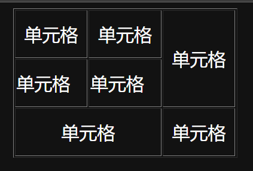
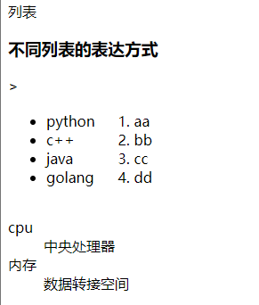
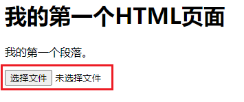

## HTML [HTML](https://www.runoob.com/html/html-tutorial.html)
	- ### Hyper Text Markup Language: 超文本标记语言
		- 超文本：不是普通文本，例如：图片，声音，视频等流媒体数据（ HTML支持流媒体）
		- 标记语言：一般都是一对一对的标签组成。<html></html>就是HTML的根标签，HTML中大部分的标签都是由开始标签和结束标签组成，都是成对出现。
		- HTML语法松散
			- 通过测试得知HTML的语法是松散的，不严格。如：没了</html>标签也可以正常运行。
			- 虽然HTML的语法不够严谨，但是还是要遵守语法规则，编写合格的代码。
			- 也不是绝对的松散，有一些特殊的标签，如果丢掉的话还是会出现问题的。
			- HTML语法不区分大小写，但是最好是全部小写。
	- ### HTML怎么开发
		- 开发：只要新建一个xxx.html或者xxx.htm的文件，然后使用编辑器直接编辑代码即可
		- 运行：使用浏览器直接打开即可运行
		- HTML集成开发环境：
			- DreamWeaver
			- HBuilder
			- WebStorm
			- IntelliJ IDEA
	- ### 第一个HTML
		- 新建一个HTML：01 first_html.html
			- ``` HTML
			  			  <!DOCTYPE html><!--HTML5的语法标记，如果没有这行标记，表示当前html页面采用的是HTML4的语法-->
			  			  
			  			  <!-- HTML的注释格式-->
			  			  <!--一定要注意合理的缩进：代码格式要规范-->
			  			  <!--有父子关系时要缩进-->
			  			  
			  			  <html> <!-- HTML的根标记-->
			  			      
			  			      <head><!--HTML的头标记-->
			  			          <!--网页的标题，显示在浏览器的左上角-->
			  			          <title>我的第一个HTML页面</title>
			  			      </head>
			  			      <!--HTML的体标记-->
			  			      <!--body是网页的主体，显示在浏览器页面上的内容-->
			  			      <body>
			  			          Hello World!
			  			      </body>
			  			  </html>CTYPE html><!--HTML5的语法标记-->
			  ```
	- ### HTML的基本标签
		- `<p></p> `： 段落标记，用于分段
		- `<h1></h1>` ：标题字1最大
		- `<h2></h2>` ：标题字
		- `<h3></h3>`
		- `<h4></h4>`
		- `<h5></h5>`
		- `<h6></h6>`： 标题字6最小
		- `<br>`： 换行标签，是个独目标记，负责在网页上换行，没有闭合标签
		- `<hr>`：水平线标签
		- `<hr color="red"`：可以设定颜色，color是属性名，red是属性值
		- ` <hr color="red" width="300px">`： 宽度
		- `<pre></pre>`：预留格式标签，可以在网页上显示编辑代码时的格式
		- `<b></b>`：粗体字
		- `<i></i>`：斜体字
		- `<ins></ins>`：插入字
		- `<del></del>`：删除字
		- `<sup></sup>`： 右上角加字
		- `<sub></sub>`：右下角加字
		- `<font size="3" color="red"></font>`：字体
	- ### 实体符号
		- | 显示结果 | 描述 | 实体名称 | 实体编号 |
		  |---|---|---|---|
		  | < | 小于号 | &lt; | &\#60; |
		  | > | 大于号 | &gt; | &\#62; |
		  | & | 和号 | &amp; | &\#38; |
		  | " | 引号 | &quot; | &\#34; |
		  | ' | 撇号 | &apos; (IE不支持) | &\#39; |
		  | ￠ | 分 | &cent; | &\#162; |
		  | £ | 镑 | &pound; | &\#163; |
		  | ¥ | 人民币/日元 | &yen; | &\#165; |
		  | € | 欧元 | &euro; | &\#8364; |
		  | § | 小节 | &sect; | &\#167; |
		  | © | 版权 | &copy; | &\#169; |
		  | ® | 注册商标 | &reg; | &\#174; |
		  | ™ | 商标 | &trade; | &\#8482; |
		  | × | 乘号 | &times; | &\#215; |
		  | ÷ | 除号 | &divide; | &\#247; |
		  | | 空格 | &nbsp; | &\#160; |
		  | < | 小于号 | &lt; | &\#60; |
		  | > | 大于号 | &gt; | &\#62; |
		  | & | 和号 | &amp; | &\#38; |
		  | " | 引号 | &quot; | &\#34; |
		  | ' | 撇号 | &apos; (IE不支持) | &\#39; |
		  | ￠ | 分 | &cent; | &\#162; |
		  | £ | 镑 | &pound; | &\#163; |
		  | ¥ | 人民币/日元 | &yen; | &\#165; |
		  | € | 欧元 | &euro; | &\#8364; |
		  | § | 小节 | &sect; | &\#167; |
		  | © | 版权 | &copy; | &\#169; |
		  | ® | 注册商标 | &reg; | &\#174; |
		  | ™ | 商标 | &trade; | &\#8482; |
		  | × | 乘号 | &times; | &\#215; |
		  | ÷ | 除号 | &divide; | &\#247; |
	- ### 基本表格
		- `<table></table>`：表格，属性：align，border,width,height
		- `<tr></tr>`：行数
		- `<td></td>`：列数
		- `<th></th>`：表头
		- ``` html
		  		      <body>
		  		          <table align="center" border="1px" width="300px" height="200px">
		  		              <tr align="center">
		  		                  <td>单元格</td>
		  		                  <td>单元格</td>
		  		                  <td>单元格</td>
		  		              </tr>
		  		              <tr>
		  		                  <td>单元格</td>
		  		                  <td>单元格</td>
		  		                  <td>单元格</td>
		  		              </tr>
		  		              <tr align="center">
		  		                  <td>单元格</td>
		  		                  <td>单元格</td>
		  		                  <td>单元格</td>
		  		              </tr>
		  		          </table>
		  		      </body>
		  ```
		- 单元格合并
			- `<td rowspan="2"`：合并行单元格
			- `<td colspan="2"`：合并列单元格
			- ``` html
			  			      <body>
			  			          <table align="center" border="1px" width="300px" height="200px">
			  			              <tr align="center">
			  			                  <td>单元格</td>
			  			                  <td>单元格</td>
			  			                  <!--将后面的单元格注释掉，
			  			                  在前面的单元格上使用rowspan属性进行行合并
			  			                  合并几个写几个
			  			                  -->
			  			                  <td rowspan="2">单元格</td>
			  			              </tr>
			  			              <tr>
			  			                  <td>单元格</td>
			  			                  <td>单元格</td>
			  			                  <!--
			  			                  <td>单元格</td>
			  			                  -->
			  			              </tr>
			  			              <tr align="center">
			  			                  <td colspan="2">单元格</td>
			  			                  <!--
			  			                  <td>单元格</td>
			  			                  -->
			  			                  <td>单元格</td>
			  			              </tr>
			  			          </table>
			  			      </body>
			  ```
			- 
		- 表格三部分
	- ### 颜色及背景
		- HTML的颜色有3种表达方式：十六进制数字、RGB值或者颜色名称。颜色可以用于设置字体、网页背景等。比如通过如下3种方式都可以设置页面背景为红色：
		- ``` html
		  		  <body bgcolor="#FF0000">
		  		  <body bgcolor="rgb(255,0,0)">
		  		  <body bgcolor="red">
		  ```
	- ### 图片
		- 在 HTML 中，图像由 标签定义。
		-  是空标签，意思是说，它只包含属性，并且没有闭合标签。
		- 要在页面上显示图像，你需要使用源属性（src）。src 指 "source"。源属性的值是图像的 URL 地址。
		- 语法：``
			- URL 指存储图像的位置。
			- alt 属性用来为图像定义一串预备的可替换的文本。
			- height（高度） 与 width（宽度）属性用于设置图像的高度与宽度。
		- > **注意:** 假如某个 HTML 文件包含十个图像，那么为了正确显示这个页面，需要加载 11 个文件。加载图片是需要时间的，所以我们的建议是：慎用图片。
		- > **注意:** 加载页面时，要注意插入页面图像的路径，如果不能正确设置图像的位置，浏览器无法加载图片，图像标签就会显示一个破碎的图片。
	- ### 超链接
		- HTML使用标签 <a>来设置超文本链接。超链接可以是一个字，一个词，或者一组词，也可以是一幅图像，您可以点击这些内容来跳转到新的文档或者当前文档中的某个部分。当您把鼠标指针移动到网页中的某个链接上时，箭头会变为一只小手。在标签<a> 中使用了href属性来描述链接的地址。
		- 默认情况下，链接将以以下形式出现在浏览器中：
			- 一个未访问过的链接显示为蓝色字体并带有下划线。
			- 访问过的链接显示为紫色并带有下划线。
			  点击链接时，链接显示为红色并带有下划线。
			- > 注意：如果为这些超链接设置了 CSS 样式，展示样式会根据 CSS 的设定而显示。
		- HTML 链接语法
			- `<a href="https://www.runoob.com/">访问菜鸟教程</a>`
				- href 属性描述了链接的目标。
				- "链接文本" 不必一定是文本。图片或其他 HTML 元素都可以成为链接。
		- HTML 链接 - target 属性
			- 使用 target 属性，你可以定义被链接的文档在何处显示。
		- HTML 链接- id 属性
			- id 属性可用于创建一个 HTML 文档书签。
			- 提示: 书签不会以任何特殊方式显示，即在 HTML 页面中是不显示的，所以对于读者来说是隐藏的。
			- 实例：
				- 在HTML文档中插入ID:
					- `<a id="tips">有用的提示部分</a>` <a id="tips">有用的提示部分</a>
				- 在HTML文档中创建一个链接到"有用的提示部分(id="tips"）"：
					- `<a href="#tips">访问有用的提示部分</a>` <a href="#tips">访问有用的提示部分</a>
				- 或者，从另一个页面创建一个链接到"有用的提示部分(id="tips"）"：
					- `<a href="https://www.runoob.com/html/html-links.html#tips">访问有用的提示部分</a>`
	- ### 列表
		- 无序列表： 用<ul>表示列表，用<li>表示表项。
		- 有序列表：用<ol>表示列表，用<li>表示表项。
		- 定义列表：用<dl>表示列表，用<dt>表示被定义词，用<dd>表示定义描述。
		- 实例
			- ``` html
			  			  <!DOCTYPE html>
			  			  <head>
			  			      列表
			  			  </head>
			  			  <body>
			  			      <h3>不同列表的表达方式</h3>
			  			      <table>
			  			          <tr>
			  			              <td>
			  			                  <ul>
			  			                      <li>python</li>
			  			                      <li>c++</li>
			  			                      <li>java</li>
			  			                      <li>golang</li>
			  			                  </ul>
			  			              </td>
			  			              <td>
			  			                  <ol>
			  			                      <li>aa</li>
			  			                      <li>bb</li>
			  			                      <li>cc</li>
			  			                      <li>dd</li>
			  			                  </ol>
			  			              </td>
			  			          </tr>>
			  			      </table>
			  			      <dl>
			  			          <dt>cpu</dt><dd>中央处理器</dd>
			  			          <dt>内存</dt><dd>数据转接空间</dd>
			  			      </dl>
			  			  </body>
			  ```
			- 
	- ### 表单
		- HTML 表单用于收集不同类型的用户输入。表单是一个包含表单元素的区域。
		- 表单元素是允许用户在表单中输入内容,比如：文本域(textarea)、下拉列表、单选框(radio-buttons)、复选框(checkboxes)等等。
		- 表单使用表单标签 <form> 来设置:
			- ``` html
			  			  <form>
			  			  .
			  			  input 元素
			  			  .
			  			  </form>
			  ```
		- 文本域（Text Fields）
			- 文本域通过<input type="text"> 标签来设定，当用户要在表单中键入字母、数字等内容时，就会用到文本域。
				- ``` html
				  				  <form>
				  				  First name: <input type="text" name="firstname"><br>
				  				  Last name: <input type="text" name="lastname">
				  				  </form>
				  ```
				- 效果：
					- <form>
					  First name: <input type="text" name="firstname">
					  Last name: <input type="text" name="lastname">
					  </form>
		- 密码字段
			- 密码字段通过标签<input type="password"> 来定义:
				- ``` html
				  				  <form>
				  				  Password： <input type='password' name='pwd'>
				  				  </form>
				  ```
				- 效果：
				- <form>
				  Password： <input type='password' name='pwd'>
				  </form>
		- 单选按钮（Radio Buttons）
			- <input type="radio"> 标签定义了表单单选框选项
				- ``` html
				  				  <form>
				  				  <input type="radio" name="sex" value="male">Male<br>
				  				  <input type="radio" name="sex" value="female">Female
				  				  </form>
				  ```
				- 效果：
				- <form>
				  <input type="radio" name="sex" value="male">Male<br>
				  <input type="radio" name="sex" value="female">Female
				  </form>
		- 复选框（Checkboxes）
			- <input type="checkbox"> 定义了复选框. 用户需要从若干给定的选择中选取一个或若干选项。
			- ``` html
			  			  <form>
			  			  <input type="checkbox" name="vehicle" value="Bike">I have a bike<br>
			  			  <input type="checkbox" name="vehicle" value="Car">I have a car
			  			  </form>
			  ```
			- 效果：
			- <form>
			  <input type="checkbox" name="vehicle" value="Bike">I have a bike<br>
			  <input type="checkbox" name="vehicle" value="Car">I have a car
			  </form>
		- 提交按钮(Submit Button)
			- <input type="submit"> 定义了提交按钮.
			- 当用户单击确认按钮时，表单的内容会被传送到另一个文件。表单的动作属性定义了目的文件的文件名。由动作属性定义的这个文件通常会对接收到的输入数据进行相关的处理。:
			- ``` html
			  <form name="input" action="html_form_action.php" method="get">
			  Username: <input type="text" name="user">
			  <input type="submit" value="Submit">
			  </form>
			  ```
			- 效果：
			- <form name="input" action="html_form_action.php" method="get">
			  Username: <input type="text" name="user">
			  <input type="submit" value="Submit">
			  </form>
	- ### 区块
		- HTML 可以通过 <div> 和 <span>将元素组合起来。
		- HTML区块元素
			- 大多数 HTML 元素被定义为块级元素或内联元素。
			- 块级元素在浏览器显示时，通常会以新行来开始（和结束）。
			- 实例: <h1>, <p>, <ul>, <table>
		- HTML内联元素
			- 内联元素在显示时通常不会以新行开始。
			- 实例: <b>, <td>, <a>, 
		- HTML <div> 元素
			- HTML <div> 元素是块级元素，它可用于组合其他 HTML 元素的容器。
			- <div> 元素没有特定的含义。除此之外，由于它属于块级元素，浏览器会在其前后显示折行。
			- 如果与 CSS 一同使用，<div> 元素可用于对大的内容块设置样式属性。
			- <div> 元素的另一个常见的用途是文档布局。它取代了使用表格定义布局的老式方法。使用 <table> 元素进行文档布局不是表格的正确用法。<table> 元素的作用是显示表格化的数据。
		- HTML <span> 元素
			- HTML <span> 元素是内联元素，可用作文本的容器
			- <span> 元素也没有特定的含义。
			- 当与 CSS 一同使用时，<span> 元素可用于为部分文本设置样式属性。
	- ### 文件
		- HTML定义了标准的文件上传控件，相应的HTML标签是<input type="file">，示例如下：
		- `input type="file" name="pic" accept=".jpg, .png, .gif">`
		- 标签虽然简单，但在浏览器中的功能十分强大。如图3.8所示的标签提供了一个文件名输入框，并且有一个浏览按钮通过操作系统的文件选择框进行文件选择，通过accept属性可以设置文件选择框中的文件筛选器。
		- 
	- ### HTML5 [HTML5 ](https://www.runoob.com/html/html5-new-element.html)
		- <canvas> 新元素
			- | 标签 | 描述 |
			  |---|---|
			  | <canvas> | 标签定义图形，比如图表和其他图像。该标签基于 JavaScript 的绘图 API |
		- 新多媒体元素
			- | 标签 | 描述 |
			  |---|---|
			  | <audio> | 定义音频内容 |
			  | <video> | 定义视频（video 或者 movie） |
			  | <source> | 定义多媒体资源 <video> 和 <audio> |
			  | <embed> | 定义嵌入的内容，比如插件。 |
			  | <track> | 为诸如 <video> 和 <audio> 元素之类的媒介规定外部文本轨道。 |
		- 新表单元素
			- | 标签 | 描述 |
			  |---|---|
			  | <datalist> | 定义选项列表。请与 input 元素配合使用该元素，来定义 input 可能的值。 |
			  | <keygen> | 规定用于表单的密钥对生成器字段。 |
			  | <output> | 定义不同类型的输出，比如脚本的输出。 |
		- 新的语义和结构元素
			- | 标签 | 描述 |
			  |---|---|
			  | <article> | 定义页面独立的内容区域。 |
			  | <aside> | 定义页面的侧边栏内容。 |
			  | <bdi> | 允许您设置一段文本，使其脱离其父元素的文本方向设置。 |
			  | <command> | 定义命令按钮，比如单选按钮、复选框或按钮 |
			  | <details> | 用于描述文档或文档某个部分的细节 |
			  | <dialog> | 定义对话框，比如提示框 |
			  | <summary> | 标签包含 details 元素的标题 |
			  | <figure> | 规定独立的流内容（图像、图表、照片、代码等等）。 |
			  | <figcaption> | 定义 <figure> 元素的标题 |
			  | <footer> | 定义 section 或 document 的页脚。 |
			  | <header> | 定义了文档的头部区域 |
			  | <mark> | 定义带有记号的文本。 |
			  | <meter> | 定义度量衡。仅用于已知最大和最小值的度量。 |
			  | <nav> | 定义导航链接的部分。 |
			  | <progress> | 定义任何类型的任务的进度。 |
			  | <ruby> | 定义 ruby 注释（中文注音或字符）。 |
			  | <rt> | 定义字符（中文注音或字符）的解释或发音。 |
			  | <rp> | 在 ruby 注释中使用，定义不支持 ruby 元素的浏览器所显示的内容。 |
			  | <section> | 定义文档中的节（section、区段）。 |
			  | <time> | 定义日期或时间。 |
			  | <wbr> | 规定在文本中的何处适合添加换行符。 |