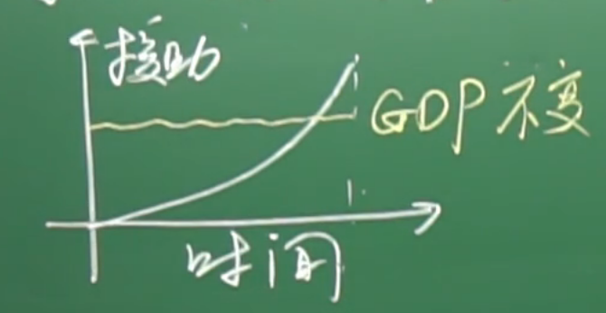
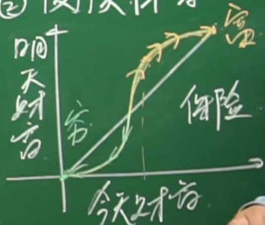

- ## [如何才能摆脱贫穷?穷人和富人有什么差别?【诺贝尔经济学奖解读】](https://www.ixigua.com/6838152864762692103?id=6752782648092934659&logTag=4aaa34cfd5f9f53ab3c4)
- 《贫穷的本质》
- 
- ### 争论：对穷人的援助有用吗？
	- 有一种现象：援助及非洲GDP随时间的变化
		- {:height 356, :width 672}
		- 怎么研究呢？做实验，随机对比试验
- ### 他们首先讨论健康的问题
	- ### 健康: 每年全球有900万人，5岁之前夭折，绝大多数在非洲，解决办法：
		- #### 疫苗：2500万儿童疫苗缺失
			- 于是到印度乌代布尔的村子进行研究，他们发现那边的疫苗接种率只有1%，为什么呢？
				- 技术上没有问题，有专业的护士----🆗
				- 资金，疫苗是免费的-----🆗
				- 家长是重视的----🆗
				- 那到底是为什么呢？他们猜想是因为打疫苗太费劲了
					- 比方说，他们打疫苗要翻山越岭到一个疫苗点，但是有可能那天护士不负责任，没有来，对于穷人来说了损失了一天的收入，对于富人来说没什么，所以长此以往穷人就不去打疫苗了。
				- 他们对此做了三套对比组
					- 1  什么都不做                结果： 6%的人带着孩子翻山越岭打疫苗
					- 2  营地      在村子附近安排人专门给孩子打疫苗          结果：17%
					- 3  营地+ 奖励        在村子附近安排人给孩子打疫苗，来打疫苗的还奖励两斤豆子       结果：38%
		- #### 疟疾
			- 最好的防治疟疾的方法是蚊帐，但是一个蚊帐是10美元，对于穷人来说太贵，如果免费发呢？他们就会产生依赖，再也不会花钱买，从此以后就等着发
			- 他们来到肯尼亚进行研究
				- 研究发现蚊帐买回去的使用比例是80%，也就是说只要买了的，基本上都会去使用
				- 不论是花2美元还是3美元买的，再次购买的概率都挺高，说明他们习惯了蚊帐的生活
	- ### 教育
		- 研究发现，一个国家的平均教育年限每增加1年，GDP 增加30%以上
		- 1 增加教育时间：
			- 
		- 2 提高教育质量
			- 存在的问题：
				- 1 教师旷工
				- 2 阅读有障碍
	- ### 经济
		- 1 穷人的生活充满风险
			- 
		- 2 穷人对金钱的使用和富人有很大的区别
			- 电视机比食物更重要
			- 越是贫穷的地方葬礼越隆重
-
-