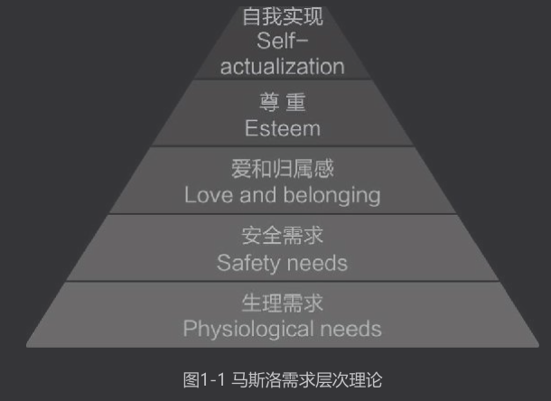

## 第一章：陪写作业的正确姿势
	- ### 孩子学习出问题，不仅在于知识点没掌握
	  collapsed:: true
		- 每天把大量的精力花在与父母的对抗上；
		- 对于学习，没有内驱力，所以行动力偏弱；
		- 在交友方面，有很多困扰，分散了一部分精力；
		- 缺乏学习方法;
		- ...
	- ### 孩子学习上的问题很少是因为学不会课堂上的知识点。
		- ### 马斯洛需求层次理论
		  collapsed:: true
			- 马斯洛需求层次理论是行为科学的理论之一，由美国心理学家亚伯拉罕·马斯洛与1943年在论文《人类激励理论》中提出。该理论将人类需求从低到高分为5个层次，分别为：
			  collapsed:: true
				- 生理需求
				- 安全需求
				- 社交需求（爱和归属感）
				- 尊重需求
				- 自我实现需求
			- 
			- 这五个需求层次呈金字塔式，马斯洛认为，**当人最基本的需求--生理需求没有得到满足时，人所有的能量都会集中在生理层面，从而无法向更高级的安全需求、社交需求等发展。**
			- 孩子的学习，就像大人的工作一样，是需要孩子有自觉性、主动性的，通过学习，孩子解决问题的能力、思考能力、理解能力等不断提升，从而成为更好的自己。所以，想要学习好，这属于自我实现需求，也就是位于“金字塔”塔尖儿位置的需求。
			- 如果“金字塔”下端的那些需求没有被满足，孩子对学习的内驱力就不会太强，也就无法把自己所有的精力与能量集中在学习上。
			- 跟随马斯洛需求层次理论，我们可以一层层探索孩子学习出问题的原因。
			- #### 一、生理需求
			  collapsed:: true
				- 当一个孩子没有休息好、睡眠不足、非常累的时候，他的撞他会影响学习效能。
				- 我的女儿心心从小就喜欢玩水，在浴缸洗澡时，都喜欢带着泳镜“潜水”。心心上幼儿园大班时，我给她报了游泳课。
				- 看了心心在游泳试课上的表现，教练对我说，这孩子大概上三节课就能学会！但是为了让心心学会四种泳姿，我还是给她报了20节游泳课。结果，你们猜怎样？心心学游泳，整整学了17节课，才学会一
				  种泳姿。
				- 教练总向我反馈说“孩子注意力不集中，对老师说的话好像没听见，不知道她在想什么”。但这些问题，我从来没有听幼儿园老师跟我反馈过。我问心心为什么注意力不集中，她也说不出为什么。后来我自己找到了原因：我给她报的游泳课在周一，周一她在幼儿园学习生活了一整天后，放学后还有一节舞蹈课，舞蹈课结束，又紧接着上游泳课。孩子累呀！
				- 《动机心理学》一书中谈到有限资源模型时指出，人们的自我控制能力是基于有限的通用资源的。之所以说是有限资源，是因为人们拥有的自我控制总能量是固定的，一旦用完（即耗尽）就不再拥有。
				- 之所以说是通用资源，是因为不同类型的反应都会使用它，包括行为、思想和情绪抑制。把这两点结合起来就会发现，不管是行为约束，还是情绪抑制，都要使用自我控制能量；在某个领域使用自我控制时，可用于另一个领域的自我控制力就会受损。现代研究者使用“自我损耗”一词来指代先前使用某个领域的自
				  我控制会损害随后其他领域自我控制力这一倾向。
				- 这一点对于孩子也同样适用，孩子白天在学校要跟紧课堂节奏，听从指令，约束自己的行为，这些都要消耗很多自制力，有的孩子放学后还去上兴趣班，晚上写作业时就容易注意力不集中，学习效率降低，这是因为在写作业之间有太多的活动消耗了孩子的自控能量，导致了孩子的自控力下降。在我的线上“自主学习力年度营”课程中，遇到学员说孩子写作业状态不好，总是闹情绪、注意力不集中，我都会关心一下孩子的兴趣班是否安排得太满，询问一下孩子的睡眠时间是否充足。
				- 我惊讶地得知，很多小学生会写作业写到晚上10点，甚至11点多才睡。这会导致孩子睡眠严重不足。
				  很多家长都熟知“食物搭配金字塔”，尽力照此均衡孩子的营养摄入，却往往忽略了“生命金字塔”的基座是睡眠。
				- 有研究表明，长期睡眠不足的人，大脑中的杏仁核会对让人情绪波动的事件更敏感，会更容易关注消极信息，情绪控制能力也更弱。所以，睡眠不足的孩子畏难情绪会更严重。精力充沛时，孩子会更有
				  信心与动力面对困难；而精力不足时，可能一个小小的难题就足以让孩子感到极大的压力。
				- 保持充足的睡眠对保证孩子的学习效率也至关重要。很多家长会认为，孩子学习时间长、挑灯夜读是勤奋的表现，一分耕耘必定会有一分收获。殊不知，这种“低水平勤奋”不仅无效，还会对知识吸收起到反作用。
				- 《自驱型成长》一书中分享了一个研究轻微睡眠限制的实验。实验要求一些六年级的学生比平常早睡或晚睡1小时，并坚持3个晚上。实验结果表明，那些睡眠时间比其他同学少35分钟的学生在后续的认知测试中表现出了四年级学生的水平，他们实际上丧失了2年的认知能力水平！
				- 睡觉时，我们大脑区域中一块叫海马体的地方会进行一件非常重要的活动——整合我们一天所学的知识，将新知识进行“审查”并储存，“过审”的知识会被大脑所记忆。海马体只有在我们睡着的时候才工作，如果我们不好好睡觉，它就没有工作的机会。如果孩子勤奋地学习到很晚，却没有得到充足的睡眠，就相当于我们辛辛苦苦写了一篇论文，却忘记按保存键。辛苦学来的知识却没有被大脑记住，是不是很可惜？
				- 《考试脑科学》这本书中这样写道：
				- 学习的基本要求是“记住自己能记住的所有知识，切实掌握自己
				  能理解的全部内容。”做到这点后，就果断地去睡觉吧！剩下的工作都交给海马体。总之，此时的铁则是“好好睡觉，期待海马体大显身手”。
				-
			- #### 二、安全需求
			  collapsed:: true
				- 安全需求直接对应一个人的安全感。
				- 你的孩子是否常常担心自己不被老师、同学喜欢？
				- 你的情绪稳定吗？会不会在孩子写作业时突然发脾气，让孩子心惊胆战？
				- 你和伴侣的关系如何？你们是否会当着孩子面吵架，以致让孩子担心爸爸妈妈会分开？
				- 内心充满安全感的孩子会相信关系是滋养的、坚固的，家是安全可依靠的，周围的人是可以信赖的，自己是值得被爱的。
				- 只有内心安定，孩子才会放心地走向更高一级的需求——社交需求。反之，他就会封闭自己，陷入反复的情绪内耗。如果孩子内心有太多的不确定、缺失与担心，他就没法集中精力去学习、成长，有一些孩子还会因为内心过度焦虑紧张而出现一些外显症状，比如咬指甲、频繁眨眼睛等。这些都是家长需要关注与重视的。
				- 那么怎样判断孩子是否缺乏安全感呢？我在《童年不缺爱》一书中列举了内心缺乏安全感的孩子常见的一些表现。
				- 要么非常黏人，要么太过独立；
				- 过度追求完美，不能接受失败；
				- 特别乖巧，很小就会察言观色、讨好大人；
				- 在社交过程中胆小退缩，对朋友多是防备的态度；
				- 非常在乎他人的认可与评价，一旦失去外界反馈，就会变得悲观消极；
				- 攻击性很强，爱打人，外表看起来很“强悍”，内心却很脆弱。
				- 到了小学阶段，内心缺乏安全感的孩子还会表现为不积极主动参加班级活动、不爱在课堂上发言，被老师反映注意力不集中、与同学相处有困难等。
				- 当然，以上这些行为，如果你的孩子“中招”了1～2条，也并不是说他一定就缺乏安全感，有些行为表现也许只是阶段性的。孩子是否缺乏安全感还要结合孩子的童年经历、日常表现等进行综合判断。
				- 如果孩子确实缺乏安全感，那么家长就需要认真审视自己的养育方式及家庭养育环境，平时是否常常忽略孩子的需求，让孩子感到关系不稳定。
				- 同时，家长也要学会通过观察孩子的行为更加敏锐地识别孩子的需求，并及时满足孩子的需求。需要注意的是，这里所说的需求，是一个人保持心理健康的基础需要，比如孩子需要被积极关注；需要在伤心委屈时被倾听，在危险时被保护；需要在日常感受到自己被爱，在关系中体会到自己被信任、被尊重，等等。
				- 当然，父母要想修复孩子缺失的安全感并不容易，如果条件允许，可以寻求专业人士的帮助，参加培训，或者找老师咨询，以更全面的视角发现问题，发现自己在养育中的盲点，更高效地改进自己的
				  养育方法。
			- #### 三、 社交需求
			  collapsed:: true
				- 随着孩子长大，父母对孩子的影响会越来越小，而同伴对孩子的影响会越来越大。孩子的学习问题，很多都和他们的社交需求没有得到满足而产生负面情绪直接相关。
				- 比如：
				- 孩子关系最好的小伙伴最近不和他玩了，孩子感到难过、不知所措；
				- 新来的老师太严厉了，孩子不喜欢，因此抗拒这门课；
				- 孩子纪律感欠缺，总被老师批评，自己也觉得“丢面子”；
				- 孩子学习成绩不理想，被同学贴上了“差生”的标签；
				- 班里有同学发展小团体，这些小团体孤立甚至欺负孩子；
				- …………
				- 以上这些，都属于孩子在社交方面出了问题，这些问题都会影响孩子的学习。那么，家长此时该怎么办呢？
				- **1.亲子沟通顺畅，孩子才愿意说**
				  collapsed:: true
					- 大家可以思考一下，如果你的孩子将这些社交困扰与你分享时，你的第一反应可能是什么？
					- 很多父母可能认为要寻找问题的原因，并引导孩子解决问题。如果是这样的思路，父母很可能会在沟通中忍不住否定孩子，或者对孩子进行过多说教。比如：
					  collapsed:: true
						- 小伙伴为什么不和你玩呢？你要反思自己啊！
						- 我觉得你们老师不严厉呀！你要学会适应不同的人。
						- 老师是严厉，但是严师出高徒，你好好遵守纪律就行！
						- 他们为什么不和你玩呢？肯定你有做得不对的地方呀！
						- ……
					- 如果父母经常这样回复孩子，孩子可能就会在内心渐渐形成一种判断：和爸妈说了也没用，还让我更生气。这样的经历多了，孩子的倾诉欲就消失了，亲子沟通之门也就此关闭。
					- 孩子一旦将父母从他的“支持系统”移除，以后他们即使遇到了困难挫折，也不会再想寻求父母的帮助与支持。这才是最麻烦的问题。
				- **2.比解决问题更重要的是学会倾听**
				  collapsed:: true
					- 正确回应孩子的方式是，我们要**克制自己的“解救欲”，先倾听孩子！要相信，只要我们给孩子足够的耐心与空间，孩子是能自己想出解决办法的。在倾听时，我们只要保持专注与好奇，同时不断地共情孩子就好。**比如可以这样回应孩子：
					  collapsed:: true
						- 是吗？那你一定很难过！
						- 老师怎么严厉了？你继续说，你上课是不是很紧张？
						- 原来是被误解了，你感到很不公平。
						- ……
					- 我们过多地给孩子提供建议，过多地说教孩子，甚至一味否定、纠正孩子，是阻碍亲子顺畅沟通的一个又一个关卡，而“积极倾听”可以让孩子有安全感、无障碍地表达自己所有的想法与感受。积极倾听时，我们能体会孩子的情绪慢慢消散，渐渐地，又会惊喜地看到他自己的解决方案开始浮现。如果被支持、被倾听的孩子开始主动寻求我们的观点与建议，这时才是我们表达自己观点和建议的最好时机，因为这是孩子最能听得进去的时候。
					- 有时，我们会觉得孩子的解决方案不够好，这种情况下，如果不是特别紧急或特别重要的事情，还是不要急于给孩子提供建议，要相信孩子实践后会自己做出调整。
					- 有时，孩子并没有提出什么解决方案，只是抱怨、倾诉一下，只要被倾听，他就会觉得好多了。毕竟，有些“问题”不能被解决，我们只能适应“问题”，学会与“问题”共处。
					- 不急于给孩子提供解决方案，而是积极地倾听孩子，能做到这一点的父母，都是敢于将人生的体验权、试错权交还给孩子的父母，是从心底信任孩子、对孩子的成长有耐心的父母，也是教育眼光更长远的父母，他们始终坚信：**比给出解决方案更重要的，是培养孩子解决问题的能力！**
			- #### 四、尊重需求
			  collapsed:: true
				- 尊重需求可分为内部尊重需求和外部尊重需求。
				- 内部尊重需求是指一个人希望在各种不同情境中感到自己是能胜任、能独立自主的，对自己有信心；
				- 外部尊重需求是指一个人希望自己能得到别人的尊重、信赖和积极正面的评价。
				- 当孩子的尊重需求得到满足时，他就会在学习中更加自觉、主动、充满内驱力。
				- 判断孩子的尊重需求是否得到满足，可以观察孩子是否有类似这样的表现：
				  collapsed:: true
					- 经常有意无意表达“我做不到”“我做不好”；
					- 写作业是否总依赖家长，不愿意独立思考；
				- 我们也需要观察自己是否有类似这样的表现：
				  collapsed:: true
					- 是否总催着孩子做事情，批评孩子不自觉；
					- 责怪孩子拖拉、磨蹭，学习效率低；
					- 给孩子讲题时经常说“怎么这个你都不会”？
				- 如果孩子或父母经常有以上这些情况，那么孩子的尊重需求就很可能没有得到满足。
				- 此外，还可以通过问孩子一个问题，了解孩子的自尊水平。
				- 可以问孩子：“如果0分代表‘我认为自己没有有点，什么都做不好’，10分代表‘我认为自己想做的事情都能做好，我非常棒’，宝贝，你给自己打积分呢？”
				- 如果孩子给自己打7分，我们可以接着问孩子：“你觉得自己在哪些地方做得好，你对自己哪些地方不满意，所以给自己打7分？”
				- 如果这个小问题，就能知道孩子对自己的内在评价是怎样的。
				- 如果孩子的尊重需求没有得到满足，可以从以下三个方面找原因。
				- **1.孩子确实做事能力欠缺，导致他对自己没有信心**
				  collapsed:: true
					- 比如：
					- 他很想集中注意力，可就是不自觉的开小差；
					- 读书总是跳字漏行，自己也不想这样，但是就是无法避免；
					- 阅读文章觉得难以理解，写文章总是没思路；
					- 孩子也想早点写完作业好好玩，可是时间不知不觉就溜走了；
					- 孩子总是丢三落四，粗心大意，自己也不知道该怎么办；
					- ......
					- 如果是上述问题，我们就要想办法帮助孩子提升专注力，培养孩子的理解力和时间管理能力，帮助孩子养成好的学习习惯，而不是一味责备孩子，让孩子对自己更没有信心。本书后面的章节会详述如何培养这些能力与习惯。
					- 自信来源于实力，实实在在的成功经历会让孩子对自己更有信心。我们可以用孩子过去的成功经历鼓励孩子，想一想，孩子是否有认真做好一件事的经历。如果孩子没有这样的经历，我们可以从日常生活的一些小事开始，也可以从孩子当下的兴趣开始，带着孩子一起取得一些成绩。
				- **2.孩子主观上缺乏自信，对自己有很多负面评价**
				  collapsed:: true
					- 如果孩子各方面能力都不错，但他就是觉得自己不行，很多事情都做不好，那么就很可能是孩子主观上自信心不足。
					- 遇到这种情况，父母要反思，日常与孩子沟通时是不是对孩子的批评、建议比较多，给孩子的鼓励比较少；是否常常将自家孩子的缺点与别人家孩子的优点相比较？
					- 父母就像一面镜子，如果能多多照见孩子的优点，或者孩子做的好的地方，孩子才会看得见，也会对自己更自信！
				- **3.亲子互动状态是信号，察觉自己是否给了孩子尊重与信任**
				  collapsed:: true
					- 很多家长对我说，孩子总是跟父母对抗：盯着孩子写作业，他偏不好好写；越催孩子，孩子越慢；告诉孩子要自己思考，可他还是一遇到难题就叫“妈妈”！
					- 我发现，这些家长有一个相同的模式：**一边指责干涉，一边代替包办。**
					  collapsed:: true
						- 一边指责孩子不抓紧时间，一边盯着孩子提高效率；
						- 一边责怪孩子不收拾书包，一边替孩子整理分类；
						- 一边责怪孩子不思考，一边急于给孩子讲题做解答。
					- 很多家长明显比孩子更关注孩子 的学习、比孩子更紧张。**家长替孩子背负着学习的任务，发泄着对孩子的不满，却忽略了对孩子的能力培养。**
					- 在家长的责备和否定下，孩子感受到不被尊重，不被信任。这种不好的感觉让孩子开始与家长对抗，或者干脆破罐子破摔：你说我不行，我就真不行；你说我磨蹭，那我就磨蹭给你看。同时，孩子在这种经常被“包办”的氛围中，受家长言语的影响，也会从内心觉得自己就是干不好，感到无力又无助。
					- 也许有家长会说：“是因为孩子表现不好，我才不信任他的。如果他自觉又高效，我也会对他有信心啊！”
					- 其实所有的孩子都一样，都想变好，但又自控力弱、没有时间观念、贪玩……而家长的教育方式，会决定亲子互动最终是走向正循环还是走向负循环。
					- 我有时也会忍不住催女儿心心赶紧去学习，言语中常不自觉地带着不满情绪。后来我发现，越这样催她，她越不开心，越会在写作业过程中磨蹭。我忍住不催她，也许她磨蹭10分钟才想起写作业，如果这时我送上一句鼓励，“今天不错啊，妈妈没提醒，你就知道主动写作业了”，孩子就会更有信心，写作业时会更努力地做好；如果她发现自己写作业时间太长，没时间玩，也会请求我与她一起想办法进行时间管理。
					- 前者就是负循环——家长催促，孩子反抗，家长不再信任孩子，只能再次催促。
					- 后者是正循环——家长等待孩子积极主动（或被简单提醒一句）去做事，孩子迈出一小步，家长就进行鼓励；受到鼓励，孩子有动力做得更好；因为孩子做得好，家长更信任孩子！
					- 亲子互动模式是负循环还是正循环，差别就在于家长是否从内心相信“孩子也希望把事情做好，希望自己是优秀的”，能否敏锐地发现孩子做得好的部分并及时予以鼓励。
					- 人性是复杂的，可以说，每个人身上都有“天使”的一面，也有“魔鬼”的一面，孩子也不例外。**如果我们更多地看见孩子“天使”的那一面，孩子就有动力做得更好，展现更多的美好；如果我们不断激发孩子“魔鬼”的那一面，孩子也会对自己失去信心，陷入恶性循环。**
			- 以上，我们主要对孩子学习出问题的原因进行了梳理，可以说是一种清晰的“诊断思路”。在孩子学习出问题时，我们可以按照马斯洛需求层次理论，一级级地进行筛查，判断孩子是生理需求没得到满足，还是没有安全感？是社交方面存在困扰，还是没有感到被尊重，或者是不够自信？通过筛查，找到自家孩子的“卡点”，进而确定下一步的行动方案。
			- **内容小结**
			- 孩子学习出问题，并不仅仅在于知识点没掌握，我们可以根据马斯洛需求层次理论，一层层地分析、探索孩子学习出问题的原因。
			- 1.生理需求没得到满足。活动、课外班安排得太多，长期睡眠不足影响了孩子学习的状态与效率。
			- 2.安全需求没得到满足。孩子缺乏安全感，导致很多情绪内耗，父母要反思孩子的成长历程并进行调整，注意识别孩子的需求，及时给予满足。
			- 3.社交需求没得到满足。如果孩子在社交方面存在困扰不知如何应对，也会影响其学习。这时，最重要的是，父母要确保亲子沟通的顺畅。多倾听，孩子才愿意说。
			- 4.尊重需求没得到满足。父母需要分析，是孩子能力欠缺等客观原因导致孩子不自信，还是亲子沟通方式不当导致孩子因主观原因缺乏自信，同时也要观察，是不是自己“一边指责一边包办”的教育方式最终损害了孩子的自信，让孩子感到不被尊重。
			- **实践出真知**
			- 觉察：想一想你的孩子学习出问题的原因可能在哪里？
			- 行动：针对自家孩子学习出问题的原因，想出至少1～2条行动方案。
	- ### 陪孩子写作业，父母该做什么，不该做什么
		- 在孩子小的时候，很多父母每天都会陪孩子玩游戏、读童书、做手工，做到高质量陪伴。进入学龄期后，孩子在家的时间有一部分就要用于写作业。这时，父母对孩子的陪伴活动中也增加了陪孩子写作业这一项内容。
		- 不过，可别小看了父母陪孩子写作业，只要方法得当，陪孩子写作业也是一种高质量的陪伴！
		- 父母在陪孩子写作业的过程中，对孩子存在的问题做出不同反馈和应对，会给孩子带来截然不同的影响。
		- 你是每天督促孩子学习，还是着重于培养孩子的自我管理能力？
		- 你是经常情绪失控，还是能客观看到问题，引导孩子去解决？
		- 你是看到孩子犯错就批评，还是会带着孩子复盘，帮助孩子形成成长型思维？
		- 如果我们每天坚持以正确、科学的方式与孩子互动，那么就能通过陪孩子写作业这件事儿，培养孩子让其受益一生的能力与品质，比如抗挫力、规划能力、解决问题的能力、积极的心态等。这将会是我们留给孩子最宝贵的财富。
		- 首先要弄清楚，父母陪孩子写业时扮演的角色是什么，陪孩子写作业的目的是什么？
		- **在陪写作业这件事上，父母不应该是监工，也不应该是助教，而应该是观察者、支持者与引导者。陪写作业的最终目的是：不用父母陪，孩子也能自主学习。**
		- 我相信大家都是认同这一点的，只是没有将这个目标清晰化，在具体执行时就难免会偏离初心。
		- #### 一、父母陪孩子写作业，不该做什么
		  collapsed:: true
			- **1. 随意打断，批评建议**
			  collapsed:: true
				- 很多时候，我们都没觉察到自己每天都在做着“助教”的活儿。
				- 孩子写作业时，我们看到孩子做错、读错的地方就立刻指出来，错的多了我们还会忍不住发脾气；
				- 孩子写作业时，我们不停地纠正孩子的坐姿、握笔姿势。
				- **我们这样做，是在追求过程中的“正确”，看似在帮孩子发现问题、培养好习惯，其实干扰了孩子的思路，影响了孩子的专注力，还破坏了孩子的心情。**
			- **2. “夺命”大催促**
			  collapsed:: true
				- 还有的时候，我们变成了“监工”，紧盯着孩子的一举一动，丝毫不放松。
				- 当然，孩子有时候的确做事慢，缺乏目标感，让人看着着急。这一方面是因为孩子年龄小，做事能力确实有限；另一方面也可能是因为孩子没有内驱力、缺乏专注力、太疲惫等。作为家长，我们要细心找到原因。
				- 遇到孩子磨磨蹭蹭，家长往往会忍不住催促。如果家长任着自己的性子来，一晚上催孩子十几、二十遍，久而久之，会严重破坏孩子对学习的主动性和内驱力，导致孩子催一下动一下，甚至催几下才动一下。同时，还会影响孩子的自我认知，他会从我们的言语中渐渐认定自己是一个“干什么都慢，干什么都不行”的人。
				- 那么我们一共怎样做，才会让陪孩子写作业变成一种有意义、高质量的亲自陪伴呢？
		- #### 二、父母陪孩子写作业“五步走”
		  collapsed:: true
			- **1.闲谈交流+当天任务规划**
			  collapsed:: true
				- 孩子放学后，父母要做的第一件事，就是先卸下孩子的“情绪包”。大家可以想象一下，孩子在学校待了一整天，一定会有一些开心的、不开心的、紧张的、有压力的或新鲜有趣的事儿。这时，孩子就好像背着一个“情绪包”，里面放着各种各样的想法和感受。
				- 那么，我们见到孩子时，最好先帮他把“情绪包”卸下来，比如和孩子一起玩个“今日之最”的游戏，轮流说一说，今天遇到的最好玩、最开心、最难过、最傻的事情分别是什么。
				- 很多父母反映不知道怎么和孩子沟通。其实，大家就记住一点，**沟通的前提是学会倾听。当我们愿意倾听，想去了解孩子、关心孩子时，沟通就成功了一大半！**
				- 我们主动倾听孩子，一方面能养成亲子间互动、交流的习惯；另一方面也能帮孩子疏散情绪，让孩子学习时更加专注、高效。
				- 等孩子的“情绪包”卸下来之后，我们就可以让孩子自己规划一下晚上的学习安排。
				- 在后面的时间管理模块，我们会讲到怎样与孩子一起制定大目标，小目标。有了这些规划，孩子就会知道每天晚上应该做哪些事儿。
				- 建议在晚上开始写作业前，让孩子简单画一下“思维导图”，把接下来具体要完成哪些任务、如何排序、中间休息几分钟，都清晰地画出来。
				- 画思维导图花不了几分钟，却能锻炼孩子统筹安排任务的能力，也能让孩子对当晚的学习任务做到心中有数。
				- 在孩子画思维导图时，我们可以提前与孩子约定，如果他在写作业过程中不小心走神了，我们怎样提醒他是他能接受的；也可以提醒孩子休息时用计时器倒计时。
				- 如果家长发现孩子写作业走神就直接提醒孩子，孩子有可能会抵触，但如果事先有约定，孩子就会更愿意接受。
			- **2.观察孩子的学习状态**
			  collapsed:: true
				- 孩子学习时，我们可以坐在孩子旁边看自己的书或处理工作事务，也可以在其他房间忙自己的事儿。
				- 如果孩子当前的学习任务比较难，或孩子处于刚刚开始写作业的阶段，需要家长的帮助，我们可以陪在孩子身边。这时，我们不要随时打断孩子，而要注意观察孩子的学习状态。
				- 孩子读分级读物时读错了好几个单词，我们可以在一边简单地记录这些错误；
				- 孩子做完口算题，帮孩子判完对错之后，记得留意孩子的易错点是哪些；
				- 孩子的学习状态怎样？遇到困难时喜欢含混过去还是停滞不前；
				- 孩子写字的笔顺是否正确，写字姿势是否端正？
				- 当我们发现孩子存在某些问题后，可以在孩子空闲时向孩子反馈。不过，不要一次反馈太多点。一段时间之内，能集中帮助孩子养成一两个好习惯就不错了。
				- **观察的目的，是要做到对孩子的情况心中有数。而要纠正孩子的行为，是需要有节奏、有规划地慢慢来的。**
			- **3.必要时提供支持**
			  collapsed:: true
				- 蒙特梭利教育法有个核心的理念，它要求教师最基本的素质就是要学会观察孩子，在孩子需要支持时才提供支持。
				- 陪写作业这件事也一样，父母学会观察后，适时向孩子提供支持，这里的支持包括实际的支持及精神上的支持。
				- 当孩子遇到不会读的字、不能理解的题意、不能确认的知识点，需要我们帮助时，我们可以向孩子提供支持。不过，我们要始终记得，陪写作业的目的是，将来孩子不需要我们陪，也可以自主地高效完成作业。当孩子问我们一个问题时，我们需要给他的不是一个简单的答案，而是解决问题的思路与方法。
				- 比如，孩子不太理解题目的意思，我们可以先用提问的方式，让孩子来猜一猜题目的意思是什么，为什么？然后再与孩子讨论。
				- 之前，女儿心心写作业时一遇到不认识的字就来问我，我会让她先将不认识的字圈出来一起问，后来，我又教会她使用词典笔，不认识的字自己用词典笔识别一下就好了。
				- 那么精神上的支持是什么呢？
				- 以心心学钢琴为例。有一次，我送心心去上钢琴课，老师问我：“心心每天在家怎么练琴？”我回答：“就她自己一个人练。”老师很诧异：“没有人陪她吗？”我说：“没有，我怎么陪她，我连五线谱都不认识，我也没有音乐细胞，我们家只有她一个人会弹钢琴。”
				- 心心的钢琴老师是一位钢琴家，对如何教孩子有自己的一套方法。她对我说：“你不会弹没关系，但你可以偶尔在旁边陪陪她，打打节奏，关心关心她有什么问题，这些都是可以的。练琴本来就不容易、不简单。她每天一个人面对这么难的事情，多孤单啊！”
				- 培养孩子独立完成任务很重要，但钢琴老师说得也很有道理，孩子的学习需要父母的参与。哪怕我们无法提供实际的帮助，多关心关心，体会体会孩子学习的感觉也是好的。亲子沟通中，最怕的是父母
				  失去了对孩子的同理心。
				- 只有投入了精力，我们才会发现“孩子挺了不起的，这么复杂的曲子都会弹了”，也能感受到孩子的不容易，“她已经克服了这么多的困难，让我们学，我们还不一定比她强呢”！
				- **只有真真切切地换位思考，感受孩子的感受，才能换来亲子间的理解，及时给孩子鼓励与支持！**
			- **4.“鸡蛋里挑骨头”般的鼓励**
			  collapsed:: true
				- 永远别忘了为孩子鼓掌！
				- 对于鼓励孩子，我们要有“鸡蛋里挑骨头”的精神。因为我们看见什么，什么就会被留下。
				- 孩子再小的进步，都值得被关注。鼓励，远比批评、纠正孩子更有意义。
				- 心心养成了习惯，每天放学回来休息前先定15分钟倒计时，时间一到就去写作业。
				- 有一次，她看到倒计时时间快要到了，就立刻拿起书包去书房了。
				- 看到这一幕，我就自然地表达了出来，“呀！今天闹钟还没响，心心就开始学习了！”
				- 结果，第二天、第三天，她都会在闹钟响之前提前去学习。
				- 当然，孩子成长的过程会有阶段性的反复，可能第二天、第三天表现很好，但第四天又开始磨蹭。出现这种情况是不是意味着鼓励没有用呢？并不是，反复是正常的，人都有懒散不想动的时候。
				- 家长们通常会有两种不同的思维，一种是批评思维，也就是习惯盯着孩子做得不好的地方，一发现孩子有做得不好的地方就批评；另一种是鼓励思维，理解孩子有做得不好的地方，一发现孩子有做得好的地方就鼓励。
				- 有批评思维的家长，总给孩子扣分；有鼓励思维的家长，不断给孩子加分。久而久之，总被扣分的孩子不想再努力争取家长心中的高分了，也对自己失去了信心；而不断被加分的孩子会期望自己做得更
				  好，他们对自己也更有自信。
				- 毕竟，**每个孩子一开始都是乐意去达成父母期望的。**
				- “要及时鼓励孩子”已经是教育中的陈词滥调了，可是我们真的做到了吗？很多时候，**我们不是不了解正确的方法，我们欠缺的是将简单的事情做到极致。**
			- **5.每日睡前复盘**
			  collapsed:: true
				- 在孩子写作业的过程中，不要总批评、说教、催促。对于孩子哪些地方做得好，哪些地方做得不好，可以在睡前进行每日复盘。
				- 具体来说，可以和孩子一起聊聊以下三个问题。
				- ①今天哪些地方做得好；
				- ②今天哪些地方还可以改进；
				- ③今天收获了什么。
				- 建议家长和孩子轮流说，各自复盘自己的一天。这样的复盘长期做下去，能够帮助孩子培养成长型思维——他不会过度在意某一天的表现如何，而是会把每一次经历都当作改进的机会。
				- “成长型思维”这个概念是美国斯坦福大学心理学家卡罗尔·德韦克提出的，与之相对应的是固定型思维，她认为，思维方式会大大影响人的一生。
				- 固定型思维的人认为，人的智力、能力是天生的，很难改变；成长型思维的人则相信通过奋斗、学习，可以让自己变得更好。
				- 所以，在遇到人生困难与挫折时，固定型思维的人更加容易逃避和放弃，把精力放在指责他人或自责上；成长型思维的人相信可以通过学习和努力去改变自己的境况，因此他们会不停地改进和尝试。
				- 一个人思维方式的形成，主要与父母和老师的反馈与引导有关。
				- 如果我们不再将注意力集中在对孩子现有水平和表现的评价上，而是集中在如何发现问题并进行改正上，孩子就更容易形成成长型思维。
				- 睡前复盘就是一个帮助孩子发展成长型思维的好方法。需要注意的是，孩子进行自我反思时，家长要多给予认可，也可以在认可的基础上提出一些建议，但一次不要提太多。要相信孩子的自我反思能力。
				- 同时，家长也要进行深刻、真诚的反思，而不是为了完成任务走形式。养育孩子的本质是父母和孩子的双向成长。
				- 建议大家试一试本节的陪写作业“五步走”。相信这样践行下去，我们陪写作业时间不会再有“鸡飞狗跳”的情况，而会充满快乐和联结感，孩子也会有满满的收获，最终，我们一定可以培养一个能够自主学习的孩子！
				- 内容小结
				- 1.父母的角色定位：不做监工和助教，要做观察者、支持者和引导者。
				- 2.父母陪写作业过程中不该随意打断孩子或对孩子提出批评、建议；忌“夺命”大催促。
				- 3.父母陪写作业“五步走”：闲谈交流+当天任务规划；观察孩子的学习状态；必要时提供支持；“鸡蛋里挑骨头”式的鼓励；每日睡前复盘。
				- 实践出真知
				- 觉察：这一小节探讨的内容中哪些是你做得好的地方，哪些是你需要再改进的地方？
				- 行动：试一试陪写作业“五步走”，感受一下当晚的陪写作业过程有什么不同。
				-
-
-
-
-
-