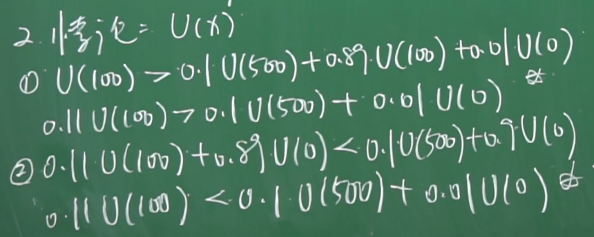
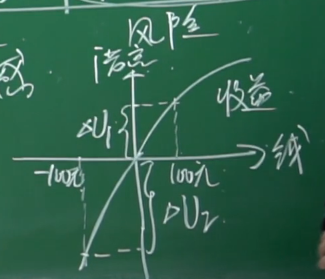

<<<<<<< HEAD
## Title：阿莱悖论--面对风险、机遇和挑战，为什么你总是赚小亏大？
=======
- ## Title：阿莱悖论--面对风险、机遇和挑战，为什么你总是赚小亏大？
>>>>>>> 30f479c74294551e969ef96ce35487abcb3ed8f9
	- ### **Video:**   [炒股为啥总赚小亏大？行为金融学是什么？李永乐老师讲阿莱悖论](https://www.ixigua.com/6621424191474237966?logTag=a081c2bffc09604d6630)
	- ### 前言
		- 期望效用理论：获得两块钱的满意度提升并不等于获得一块钱满意度提升的两倍，但是无论是期望还是效用，都属于传统经济学范畴，传统经济学认为人是理性的，但是现在我们在投资股票证券的时候发现了很多的非理性行为，这又如何解释呢？今天我们就来研究以下这个问题。
	- ### 阿莱斯悖论
		- 1952年  法国   诺贝尔经济学奖  著名经济学家**阿莱斯**提出
		- #### 实验
			- 实验一：A和B必须选一个
				- 选项A：给每个实验者100万美元，他有100%的概率会获得100万元。
				- 选项B：有10%的概率会获得500万元，有89%的概率会获得100万元，1%的概率什么都获得不了。
			- 实验二：C和D必须选一个
				- 选项C：有11%的概率会获得100万元，还有89%的概率什么都获得不了
				- 选项D：有10%的概率会获得500万元，90%的概率什么都获得不了
			- 实验结果： 大部分选择A和D
			- **但是**：有以下悖论：选项A对应上面的不等式，选项D对应下面的不等式，发现两个不等式互斥
				- 
	- ### 行为经济学
		- 1979年 美国  特沃斯基  卡纳曼 ：**前景理论又称预期理论**
		- #### 前景理论/预期理论：
			- 人们在面对风险收益的时候，实际上人们的行为是不一样的
			- 风险：
				- 收益：人们面对收益的时候，总是表现出风险厌恶，也就是人们不喜欢风险，而喜欢确定
				- 损失：人们面对损失的时候，人们表现出风险偏好，人们喜欢风险
				- 如下这个例子：
					- 情况1：有100%的概率会获得1万元或50%的概率获得2万元和50%的概率获得0元，大部分人会选择前一个选项。
					- 情况2：有100%的概率会亏1万元或者50%的概率不亏和50%的概率亏2万元，大部分人会选择后一个选项。
					- 但其实这两个选项是一样的，比如将情况1减去2万元，其实和情况2就一样了，只是人们因为心理面对收益和亏损的时候做出了不同的判断。
					- 
			- 对于损失，人们会更加敏感，比收益更加敏感
				- 
-
<<<<<<< HEAD
=======
-
-
-
-
-
-
-
-
-
-
-
-
-
-
>>>>>>> 30f479c74294551e969ef96ce35487abcb3ed8f9
-